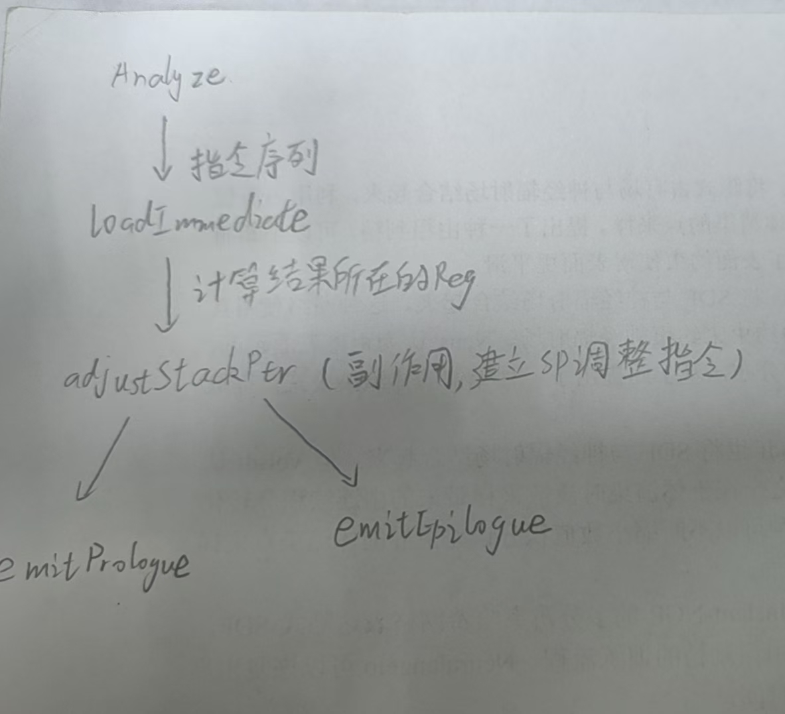

# 0 总流程 
	目标：编写一个编译器后端，接收LLVM-IR,输出一个cpu0体系架构下的ELF可执行文件
	cpu0相关信息参考网址: http://ccckmit.wikidot.com/ocs:cpu0, 也可以在cpu0教程提供的pdf中参考（21页）
	接下来是流程。
	这个文档主要记录做了什么，暂时不分析原因，逻辑自己去连。
- 注册后端。这一步只是注册一个最简单的后端，不具备代码生成功能，只是让llc(LLVM后端处理工具知道有cpu0的存在)

## 一些感悟 
- 不要自己随便构造一个逻辑去总结，应该先记录再总结，在事实的基础上总结，不然总结很容易与实际不一致，记了也没用
- 细节不要扣的太深，不然也记不住
- 提前了解大框架是很重要的，但是不要一上来就扣大框架的细节，大框架就大概记住
- 实事求是，做了什么就记什么，不要把理论上学了但还没见到的东西写上去
- 学习后端这种及其复杂的面向对象代码时，如果没有很好的参考资料，一开始的时候就先不要去试图弄懂接口背后的逻辑，先把常用接口本身提供设什么功能，需要实现哪些接口给搞懂再说

# 1 注册后端 
	目标：注册一个最简单的后端，不具备代码生成功能，只是让llc(LLVM后端处理工具知道有cpu0的存在)
	分析：思考一个目标机在后端的地位，在代码生成的哪些阶段启什么作用

## 1.1 影响的范围 
- 指令选择：需要知道目标机指令与IR的转换关系
- 指令调度：需要知道指令的成本（属于目标机指令信息）
- 寄存器分配：需要知道目标机的寄存器信息
- 代码发射：需要知道目标文件是什么格式（不管是汇编还是目标文件)，因为要打印汇编指令，所以汇编（指令）格式是一定需要的，因为要生成目标(.o/.obj)文件，所以目标文件格式是需要知道的(ELF)

	在这些分析后，大概可以知道LLVM中有哪些文件要改，要添加了
## 1.2 修改的文件 
这里说的修改只是为了让LLVM知道有一个叫cpu0的后端

- Triple相关文件，因为有一个新目标
- ELF相关文件，因为ELF处理程序需要知道有一个新处理器

## 1.3 后端初始化 
### 1.3.1 tbl描述文件 
- 指令集描述：Cpu0InstrFormats.td 和 Cpu0InstrInfo.td, 格式文件描述了所有类型的指令格式，信息文件注册了具体的指令
- 寄存器描述: Cpu0RegisterInfo.td, 定义寄存器，分组，命名
- 调度描述：Cpu0Schedule.td，描述了调度信息,继承自InstrItinClass类。这个文件中需要说明指令的流水线信息，用来调度（目前了解的不是很清楚)。还定义了两个功能单元信息，ALU和IMULDIV,一个运算器，一个乘除法指令

### 1.3.2 添加的cpp文件 
- 目标机:加一个空TargetMachine框架
- MC目标机描述：加一个空的MC层框架。
- 目标信息（位数，大小端之类的):

目标机和MC目标机都能引用到当前.td文件生成的inc文件

### 1.3.3 修改公共文件 
不是重点，主要是修改公共部分将新建的cpu0文件夹下的项目按照LLVM后端标准格式添加到llc项目中。看1.2节。

# 2 后端结构 
目标：向后端添加新的东西，让该后端能真正生成简单的汇编代码

分析：这一章主要是学习后端代码结构，因为LLVM后端代码结构基本都相似，代码基本都是复制，所以重点是学习后端代码的结构搞清楚哪些是已经实现好的，哪些是需要用户实现的。接下来从LLVM后端的工作流程来说明哪些东西需要用户实现。

## 2.1 目标机器架构 
	任何后端都需要一个目标机，这节汇总一下后端需要的目标机描述信息。
	
### 2.1.1 目标属性 

#### （1）TargetMachine类

文件：
- Cpu0TargetMachine.h/.cpp

类：
- Cpu0TargetMachine

定义Cpu0自己的TargetMachine类，写了构造方法，大部分参数都是照抄Mips的，需要自己改的只有少数部分，如下：

- DataLayout: 一个字符串，包括了大小端,E-m:m-p:32:32-i8:8:32-i16:16:32-i64:64
- ABI：目前只是传了一个ABI,**不知道在哪实现的，难道是一个外部参数吗？在MC目标描述中**
- Relocation: 重定位模式，对这个概念还不太了解。若自己没指定或使用了JIT，就是用静态模式。

其他方法:

- 同时派生出Cpu0elTargetMachine类和Cpu0ebTargetMachine类，区别只在于数据布局？
- 实现获取子目标的方法：一直搞不懂SubTarget到底是啥
- 实现PassConfig类()的定义与获取

#### （2）栈帧管理初始化（）

文件:
- Cpu0FrameLowering.h/.cpp
- Cpu0SEFrameLowering.h/.cpp

类：
- Cpu0FrameLowering

了解了cpu0栈帧的结构，只写在了注释里，并未声明，这里返回了一个FrameLowering类

之后在SE版本中，初始化**序曲**和**尾声**的处理方法

#### （3）指令处理

文件：
- Cpu0InstrInfo.h/.cpp
- Cpu0SEInstrInfo.h/.cpp

类：
- Cpu0InstrInfo,继承自.td生成的Cpu0GenInstrInfo类
- Cpu0SEInstrInfo

目的是处理.td文件说不清的指令，但目前只是搭了个框架

- 一是构造函数：一个Instrinfo类
- 二是一个获取寄存器信息的方法

SE版本也差不多

#### (4) 指令下降

文件：
- Cpu0ISelLowering.h/.cpp
- Cpu0SEISelLowering.h/.cpp

类：
- Cpu0TargetLowering
- Cpu0SETargetLowering

这一步也是搭个框架，必不可少的是对函数调用的处理，这里声明了几个重要函数:

- lowerGlobalAddress:不知道干啥
- LowerReturn: 将IR中的return指令替换为cpu0的，并做其他处理
- LowerFormalArguments: 处理函数参数（？），源码里的注释说是吧物理寄存器下降为虚拟寄存器（为啥要这么干？）

因为涉及到了函数调用，所以这里也包含了Cpu0CallingConv.td生成的inc文件，毕竟要参考调用规范

SE类直接继承，没有什么新东西

#### （5） 函数参数处理

文件：
- Cpu0MachineFunctionInfo.h/.cpp

类：
- Cpu0MachineFunctionInfo

处理和函数参数有关的东西，为啥不在上面那一步处理？对外提供了变量VarArgsFrameIndex的获取和修改的接口，目前被Cpu0TargetLowering类所使用

#### （6）ABI信息 

文件：
- MCTargetDesc/Cpu0ABIInfo.h/.cpp

类：
- Cpu0ABIInfo,不继承什么，完全是一个提供信息的类

这个ABI信息保存在MCTargetDes里

提供了3种ABI,(未知，O32, I32),不知道有什么区别，接下来看看重要参数和方法

- GetByValArgRegs():获取按值传递的寄存器组
- GetVarArgRegs(): 获取用于存放变量参数列表的寄存器组
- GetCalleeAllocdArgSizeInBytes(): 获取被调用者参数占据的字节大小
- 还有一些获取SP,FP的方法

#### （7）寄存器信息 
Cpu0CallConv.td，这个文件中定义了函数调用的约定，比如哪些寄存器要保存，这里会使用一些信息

补充一些td文件讲不清的东西，因为有点多，以下只列出几个重要的方法：

- getCalleeSavedRegs：获取被调用函数保存的寄存器列表
- eliminateFrameIndex: 将FrameIndex(帧索引表达了一个在抽象栈中的对象地址)转化为SP/FP和一个偏移
- getReservedRegs：获取预留寄存器（不参与分配），包括了(Cpu0::ZERO, Cpu0::AT, Cpu0::SP, Cpu0::LR, /*Cpu0::SW, */Cpu0::PC)

SE版本中并没有什么新的

#### （8）SubTarget类 
一个串起一大堆类的类，算是个中枢，实现了一大堆东西，暂时还不懂为啥

- 一大堆获取接口，具体访问哪些可以看看原书中的类关系图
- 初始化本体，会根据一些信息判断数据布局、CPU型号等等
	

#### （9）目标对象（.o）文件 

#### （10）调用规范(CallingConv.td) 
主要是声明了调用时保留的寄存器,重要的就一句话

	def CSR_O32 : CalleeSavedRegs<(add LR, FP, (sequence "S%u", 1, 0))>;
	总的就是把LR和FP保存了

#### （11）信息汇总(cpu0.td) 
- 新增指令，cmp和slt
- 对应于指令新增的特征，是否有那些指令
- 定义了cpu0(Target)

### 2.1.2 寄存器 
- 全局信息，包括总数量和类别
- 详细信息，每个寄存器的名字，编号，调度优先级

### 2.1.3 指令集 
- 输入
- 输出
- 汇编格式（汇编打印与解析）
- 匹配方式（指令选择）
- 匹配先决条件
- 类型（跳转，结束，分支，或者是非跳转类）

## 2.2 汇编打印 
这一节最好配合着CodeEmitter的类框架来看，会有比较清晰的认知
### （1）Cpu0InstPrinter.h/.cpp 
建了InstPrinter文件夹，文件放在里面。定义了一个InstPrinter类，继承自MCInstPrinter，这个类以MCInst为输入，输出td文件中定义好格式的指令。指令输出主要由几个小函数组成，其实就是一个指令的组成部分，列举一下:

- 指令的名字
- 寄存器名
- 操作数，操作数又分好几种，立即数、存取的地址，寄存器类数据

### （2）Cpu0MCInstLower.h/.cpp 
顾名思义，这个类是把MI格式下降为MCInst。也可以从指令的组成格式来看需要的方法：

- LowerOprand: 下降操作数，按照操作数类型来处理（寄存器，立即数），处理的逻辑LLVM已经实现了，不用管
- Lower: 下降指令，也很简单，就是先设置Op代码（指令标识，相当于指令名字），然后分别下降操作数

### （3）Cpu0BaseInfo 
定义了一些宏，不知道干啥

### （4）Cpu0MCAsmInfo.h/.cpp 
定义了一些汇编格式通用的东西，比如一些变量前缀

### （5）汇编打印机（Cpu0AsmPrinter.h/.cpp） 
目的是使用之前填充好的框架打印出汇编语句。输入是MI,输出是汇编语句，按照函数内外可分为两部分：

#### 函数体 
emitInstruction,就是调用之前实现的框架，将指令从 MI->MCInst-(MCStreamer)->汇编，在这里直接调用已实现的功能即可。

#### 函数头尾和文件头尾 
- void printSavedRegsBitmask(raw_ostream &O);
- void printHex32(unsigned int Value, raw_ostream &O);
- void emitFrameDirective();
- const char *getCurrentABIString() const;
- void emitFunctionEntryLabel() override;
- void emitFunctionBodyStart() override;
- void emitFunctionBodyEnd() override;
- void emitStartOfAsmFile(Module &M) override;

看着很多其实很简单，看名字就知道要做什么，这些函数基本也都是继承过来的，所以只管实现就好。有几个是打印注释的，可以看看cpu0汇编格式。

#### (6）修改MC描述 
为MC注册了几个类，并且添加了主目标中，为什么这时候才开始注册MC的信息？

- RegisterMCInstrInfo
- RegisterMCRegInfo
- RegisterMCSubtargetInfo
- RegisterMCInstrAnalysis
- RegisterMCInstPrinter

子目标、寄存器、指令信息、打印器都是常见的，这里又多了个指令分析
## 2.3 指令选择（DAGToDAGIsel） 
	先看指令选择流程图

- 映射(Build initial DAG) 
	{Target}TargetLowering,首次输出到SelDAG时，跳转指令需要直接转为物理指令。
- DAG合并 
	{Target}ISelLowering中的TargetLowering类,可定制合并规则
- 类型、操作合法化
	{Target}ISelLowering,可定制合并规则。
	类型合法化：需要在TargetLowering(ISelLowering.cpp)的构造方法中使用addRegisterClass表明合法的操作数和寄存器类型
	操作合法化：在TargetLowering类的构造方法中指明回调函数setOperationAction
- DAG->DAG
	{Target}DAGtoDAGSel

### （1）指令选择器注册(Cpu0ISelDAGToDAG.h/.cpp) ###
记录几个重要的方法

- select:入口方法
- trySelect：被select调用，td处理不了的都在这里处理
- selectAddr：处理复杂地址（还没看懂）
- getImm：直接获取一个常数

SE版本中并没有新东西，只是实现了trySelect方法

最后在目标机(Target Machine)里注册一下指令选择器

## 2.4 ret指令处理 
之前在ISelLowering中处理过ret指令，转化成了CPU0ISD:Ret,但是并没有进一步的处理（DAG2DAG），所以需要指明在DAG2DAG的过程中，ret对应的ISD会如何处理

### (1) 增加调用约定 

文件：
- Cpu0CallingConv.td

指定返回值存放寄存器,V0, V1, A0, A1

### (2) 增加伪指令格式并注册 

文件：
- Cpu0InstrFormats.td
- Cpu0InstrInfo.td

伪指令格式：CPU0Pseudo

同时注册一个RetLR伪指令，并将其与DAG图中的结点-Cpu0ISD:Ret-关联起来，表示该SDNode下降的指令是RetLR指令（冒充机器指令）

### (3) 返回指令下降 

文件：
- Cpu0ISelLowering.h/.cpp

类：
- TargetLowering

分析返回值：按照调用约定分析返回值合不合规，不合规就结束流程。

更新LowerReturn:主要是增加了根据调用约定检查返回值的步骤，同时返回的是 ret &lr(搞不懂)

在SE中增加伪指令展开，展开的伪指令是RetLR,展开的结果是BuildMI(..., get(Cpu0::RET)).addReg(Cpu0::LR)。太奇怪了，RetLR到底是什么时候被用到的?

注意：指令集中RET的操作就是把LR的值传到PC里，RET不接受立即数（RET的参数只有LR），所以把立即数放到了返回值寄存器

### (4) 伪指令展开

文件:
- Cpu0SEInstrInfo.h/.cpp

## 2.5 栈帧管理
### (1)立即数处理
因为涉及到栈指针偏移的计算，但是无符号立即数加法用来表示立即数的位数有限，所以必须重新处理。这一部分会返回一个指令序列去替代原本的无符号加法

### (2) 序曲和尾声 ###
- {Target}FrameLowering

**序曲**

1. 计算SP偏移，并移动SP
2. 按照调用约定保存寄存器
3. 发出一些伪指令（一些debug信息，CFI之类的）

**尾声**

1. 把SP移回去
2. 只能推断是LLVM自己把栈里的寄存器值放回去了

**determineCalleeSaves**

在运行时决定哪些寄存器需要保存，这是.td无法处理的部分，当然保存和放回这些操作都交给LLVM去做了

### (3) 从栈中存取数据Cpu0SEInstrInfo.h/.cpp ###
主要实现了两个重要函数，都是继承来的

storeRegToStack

loadRegFromStack 

### 2.6.1 栈指针处理流程 ###

在序曲和尾声中，会计算出新栈所需的大小，不用自己算，然后逐级向下传递。前言与序曲都是虚函数，是供后端框架调用的接口。

### 2.6.2 立即数减法计算流程 ###
	就是上面那个图里的Analyze,为什么不算补码？因为算不了，没有对应的指令，按位取反是最简单的

## 2.7 操作数处理 ##

## 2.8 td文件常见变量说明 ##
[tablegen参考](https://llvm.org/docs/TableGen/ProgRef.html)

- Pat: 是一种匹配规则，定义是这样def apat:Pat<src, dst>; src是源模式，dst是目标模式
- ComplexPattern: 代表一种复杂模式的匹配，单独使用tablegen无法处理匹配逻辑，需要在c++中实现。用法，def ADDRrr : ComplexPattern<i32, 2, "SelectADDRrr", [], []>;这个例子匹配两个i32类型的数字，在cpp中通过方法SelectAddRrr来实现具体地转换逻辑
- PatFrag:
- PatLeaf
- dag:
- Ops:

# 3 增加指令 #
	从后端转换的数据类型变化来考虑需要做什么。
	(1)C->LLVM IR
	看看新支持的C语句会带来哪些新的IR语句
	(2)LLVM IR -> SelDAG
	初步映射，支持新的IR语句意味着需要新的目标机ISD以及物理指令。这就带来两种情况，物理机直接或不直接支持SelDAG中的指令或数据类型，需要考虑使用已有物理指令实现或报错。这可以分为以下几种情况：
	Promote: 某操作的操作数不受支持，如读入一个位，这时可以提升这个操作数位一个字节
	Expand: 某操作或操作数类型不受支持，但是可以用别的操作或数据类型简单的拼凑成
	Custume: 某操作不被支持，但没法简单的实现，需要比较复杂的定制
	Legal: 操作被直接支持
	(3)SelDAG->MI
	(4)MI->MCInst
## 3.0 常用td语句参数信息
- def SDT_Cpu0Ret          : SDTypeProfile<0, 1, [SDTCisInt<0>]>;
	这是一个类型规范，0表示结果数量，1表示操作数数量，[*]表示约束，这里的约束是索引为0的操作数必须是int类型
- def Cpu0DivRem    : SDNode<"Cpu0ISD::DivRem", SDT_Cpu0DivRem,[SDNPOutGlue]>;
	这时一个自定义ISD,最后一个数表示节点属性，这里是胶水属性
## 3.1 算数指令
-glue:胶水属性，确保运算顺序不会乱
## 3.2 逻辑指令