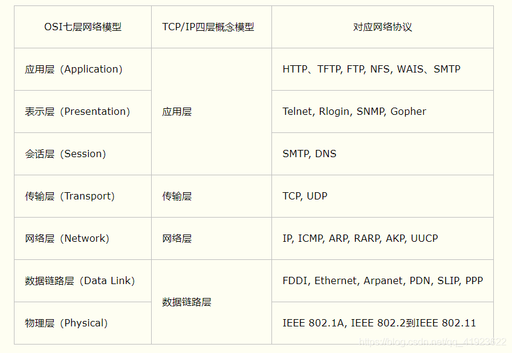

# C++

## 1、面向对象的三大特性

## （1）继承

- **定义**：让某种类型对象获得另一个类型对象的属性和方法。
- 它可以使用现有类的所有功能，并在无需重新编写原来的类的情况下对这些功能进行扩展
- 常见的继承有三种方式：
  1. 实现继承：指使用基类的属性和方法而无需额外编码的能力；
  2. 接口继承：指仅使用属性和方法的名称、但是子类必须提供实现的能力；
  3. 可视继承：指子窗体 (类) 使用基窗体 (类) 的外观和实现代码的能力。
- 例如，将人定义为一个抽象类，拥有姓名、性别、年龄等公共属性，吃饭、睡觉、走路等公共方法，在定义一个具体的人时，就可以继承这个抽象类，既保留了公共属性和方法，也可以在此基础上扩展跳舞、唱歌等特有方法。

## （2）封装

- 数据和代码捆绑在一起，避免外界干扰和不确定性访问。
- 封装，也就是把客观事物封装成抽象的类，并目类可以把自己的数据和方法只让可信的类或者对象操作，对不可信的进行信息隐藏，例如：将公共的数据或方法使用public修饰，而不希望被访问的数据或方法采用private修饰。

## （3）多态

- 编译时多态（静态多态）：函数重载，编译器根据函数实参的类型，可推断出要调用那个函数，如果有对应的函数就调用该函数，否则出现编译错误。重载：允许存在多个同名函数，而这些函数的签名不同（参数个数，参数类型，参数顺序）。
- 运行时多态（动态多态）：在程序运行期间，根据具体拿到的类型确定程序的具体行为，调用具体的函数。

## 2、虚函数

### （1）相关定义

- **定义和作用**：在实现c++多态时会用到虚函数。虚函数使用的核心目的是**通过基类访问派生类定义的函数**。所谓虚函数就是在基类定义一个未实现的函数名，为了提高程序的可读性，建议派生类中虚函数都加上virtual关键字。
- **表现**：在子类中重新定义父类方法这种行为称为覆盖（override）。
- **常见用法**：声明基类指针，利用指针指向任意一个子类对象，调用相关的虚函数，动态绑定，由于编写代码时不能确定被调用的是基类函数还是那个派生类函数，所以被称为”虚“函数。
- **虚函数与纯虚函数**：
  - 定义一个函数为虚函数，不代表函数为不被实现的函数。
  - 定义一个函数为虚函数是**为了允许用基类的指针来调用子类的这个函数**。
  - 定义一个函数为**纯虚函数，才代表函数没有被实现**。
  - 定义纯虚函数是为了实现一个接口，起到一个规范的作用，规范继承这个类的程序员必须实现这个函数。纯虚函数是在基类中声明的虚函数，它在基类中没有定义，但要求任何派生类都要定义自己的实现方法。
  - 在基类中实现纯虚函数的方法是在函数原型后加 =0。

### （2）虚表相关

- 在C++中，虚表指针的大小和虚函数表的大小都与具体实现相关。在一般情况下，虚表指针的大小为4（32位）或者8（64位）个字节，虚函数表的大小取决于类中虚函数的个数。
- 子类虚继承父类时，会有虚基类指针，每多一个父类就多一个虚基类指针，32位机器中每个指针为4 字节，64位机器中每个指针为8 字节。
- 子类、父类的虚函数表不共通，关于表的大小，子类会在复制了父类的虚函数表基础上，加上自己新建的虚函数个数*4（32位系统为4，64位系统为8）；而计算有虚表的类的大小时，因为类内只存储一个指向虚函数表的指针，因此就是占一个指针大小。
- 虚函数表存在于全局数据区.data，每个类仅有一个，供所有对象共享。

### （3）构造与析构相关

- **构造函数不能定义为虚函数**；虚函数对应一个虚表，类中存储一个vptr指向这个虚表。如果构造函数是虚函数，就需要通过虚表调用，可是对象没有初始化就没有vptr，无法找到虚表，所以构造函数不能是虚函数。
- **析构函数可以是虚函数**；当使用父类指针指向一个子类对象时，如果要释放该指针指向的对象，如果是正常的析构函数，没有使用 virtual 定义虚析构函数，则只会调用父类的析构函数，子类的析构函数不会被调用到；
- 虚析构函数可以确保首先调用子类的析构函数，然后调用父类的析构函数；这样可以避免在释放子类对象时出现内存泄漏的情况。

## 3、编译过程

- **预处理（Pre-Processing）**：包括宏定义，文件包含，条件编译三部分。预处理过程读入源代码，检查包含预处理指令的语句和宏定义，并对其进行响应和替换。预处理过程还会删除程序中的注释和多余空白字符。最后会生成 .i 文件。
- **编译器（Compiling）**：编译器会将预处理完的 .i 文件进行一系列的语法分析，并优化后生成对应的汇编代码。会生成 .s 文件。
- **汇编器（Assembling）**：汇编器会将编译器生成的 .s 汇编程序汇编为机器语言或指令，也就是机器可以执行的二进制程序。会生成 .o 文件。
- **链接器（Linking）**：链接器会来链接程序运行的所需要的目标文件，以及依赖的库文件，最后生成可执行文件，以二进制形式存储在磁盘中。

#### 链接
链接就是把多个目标文件整合到一起。以ELF文件为例，在汇编结束后会生成一系列.o文件。链接的输出有好几种，一种是可执行文件，一种是库文件，库又分为静态库和动态库。

链接的过程就是把一堆.o文件合并，相同的段合并到一起形成一个新文件。函数的调用也会在这里解决。

## 4、智能指针

- 智能指针存在的意义是帮助开发者管理动态分配的内存，它会帮助我们自动释放new出来的内存，从而**避免内存泄漏**
- auto_ptr 是c++ 98定义的智能指针模板，其定义了管理指针的对象，可以将new 获得（直接或间接）的地址赋给这种对象。当对象过期时，其析构函数将使用delete 来释放内存。auto_ptr 基于排他所有权模式：两个指针不能指向同一个资源。
  - auto_ptr 被C++11抛弃的主要原因：
  - 1). 复制或者赋值都会改变资源的所有权
  - 2). 在STL容器中使用auto_ptr存在着重大风险，因为容器内的元素必须支持可复制和可赋值
- unique_ptr "唯一"拥有其所指对象，同一时刻只能有一个unique_ptr指向给定对象 (通过禁止拷贝语义、只有移动语义来实现)。unique ptr指针本身的生命周期: 从unique_ptr指针创建时开始，直到离开作用域。离开作用域时，若其指向对象，则将其所指对象销毁(默认使用delete操作符，用户可指定其他操作)。unique_ptr指针与其所指对象的关系:在智能指针生命周期内，可以改变智能指针所指对象，如创建智能指针时通过构造函数指定、通过reset方法重新指定、通过release方法释放所有权、通过移动语义转移所有权。
- shared_ptr 允许多个指针指向相同的对象。shared_ptr使用引用计数，每一个shared_ptr的拷贝都指向相同的内存。每使用他一次，内部的引用计数加1，每析构一次，内部的引用计数减1，减为0时，自动删除所指向的堆内存。
- weak_ptr 是一种不控制对象生命周期的智能指针,它指向一个 shared_ptr 管理的对象。进行该对象的内存管理的是那个强引用的 shared_ptr,weak_ptr只是提供了对管理对象的一个访问手段。weak_ptr 设计的目的是为配合 shared_ptr而引入的一种智能指针来协助shared_ptr 工作,它只可以从一个 shared_ptr 或另一个weak_ptr 对象构造,它的构造和析构不会引起引用记数的增加或减少。
- 循环引用是指使用多个智能指针share_ptr时，出现了指针之间相互指向，从而形成环的情况，有点类似于死锁的情况，这种情况下，智能指针往往不能正常调用对象的析构函数，从而造成内存泄漏。为了避免这种情况，我们可以使用弱指针weak_ptr，他不增加引用次数。

## 5、关键字

### （1）static

1. 静态局部变量
   - 当 static 修饰局部变量时：

     - 变量的存储区域由栈变为静态常量区。
     - 变量的生命周期由局部调用结束变为程序运行结束。
     - 变量的作用域不变。
2. 静态全局变量
   - 当 static 修饰全局变量时：

     - 变量的存储区域在全局数据区的静态常量区。
     - 变量的作用域由整个程序变为当前文件。（extern声明也不行）
     - 变量的生命周期不变。
3. 静态函数
   - 当 static 修饰函数时：

     - 函数的作用域由整个程序变为当前文件。（extern声明也不行）
4. 静态成员变量
   - 静态成员无法在构造函数初始化列表初始化；
   - 静态的成员变量一定要在类外进行初始化，定义时不用加 static ，类中只是声明；
   - 静态成员变量为所有类对象所共享，并没有包含在具体的对象中，所以并不影响 sizeof() 大小；
   - 静态成员变量的访问：类名::静态成员变量名 or 对象.静态成员变量名。
   - 在类中的static成员变量属于整个类所拥有，对类的所有对象只有一份拷贝；
5. 静态成员函数
   - 静态成员函数没有隐藏的 this 指针，不能访问非静态成员（变量、 函数）;
   - 非静态成员函数可以调用静态成员函数。
   - static成员函数不能被virtual修饰，static成员不属于任何对象或实例，所以加上virtual没有任何实际意义；静态成员函数没有this指针，虚函数的实现是为每一个对象分配一个vptr指针，而vptr是通过this指针调用的所以不能为virtual；虚函数的调用关系：this->vptr->vtable->virtual function

- static的第一个作用是**隐藏**。当同时编译多个文件时，所有未加static前缀的全局变量和函数都具有全局可见性
- static的第二个作用是**保持变量内容的持久**。存储在静态数据区的变量会在程序刚开始运行时就完成初始化，也是唯一的一次初始化。共有两种变量存储在静态存储区：全局变量和static变量，只不过和全局变量比起来，static可以控制变量的可见范围，说到底static还是用来隐藏的。
- static的第三个作用是**默认初始化为0**。其实全局变量也具备这一属性，因为全局变量也存储在静态数据区。在静态数据区，内存中所有的字节默认值都是0x00。

### （2）const

- 不考虑类的情况：

  - const常量在定义时必须初始化，之后无法更改；
  - const形参可以接收const和非const类型的实参。

- 考虑类的情况：

  - const成员变量：不能在类定义外部初始化，只能通过构造函数初始化列表进行初始化，并且必须有构造函数；不同对象对其const数据成员的值可以不同，所以不能在类中声明时初始化；
  - const成员函数：const对象不可以调用非const成员函数，非const对象都可以调用；不可以改变非mutable（用该关键字声明的变量可以在const成员函数中被修改）数据的值。

- 指针：

  - 指针常量：是指定义了⼀个指针，这个指针指向⼀个只读的对象，不能通过指针常量来改变这个对象的值。指针常量强调的是指针对其所指对象的不可改变性。int const *p/ const int *p

  - 常量指针：指针常量是指定义了⼀个指针，这个指针的值只能在定义时初始化，其他地方不能改变。常量指针强调的是指针的不可改变性。int* const p

### （3）define宏定义和typedef的区别

- 宏主要用于定义常量及书写复杂的内容；typedef主要用于定义类型别名；
- 宏替换发生在编译阶段之前，属于文本插入替换；typedef是编译的一部分；
- 宏不检查类型，typedef会检查数据类型；
- 宏不是语句，不在最后加分号；typedef是语句，要加分号标识结束注意；
- 对指针的操作，typedef char * p char和#define p char char *区别巨大

### （4）volatile

- volatile 关键字是一种类型修饰符，用它声明的类型变量表示可以被某些编译器未知的因素更改，比如：操作系统、硬件或者其它线程等。遇到这个关键字声明的变量，编译器对访问该变量的代码就不再进行优化，从而可以提供对特殊地址的稳定访问。
- 当要求使用 volatile 声明的变量的值的时候，系统总是重新从它所在的内存读取数据，即使它前面的指令刚刚从该处读取过数据。
- volatile 定义变量的值是易变的，每次用到这个变量的值的时候都要去重新读取这个变量的值，而不是读寄存器内的备份。多线程中被几个任务共享的变量需要定义为 volatile 类型。
- 多线程下的 volatile：当两个线程都要用到某一个变量且该变量的值会被改变时，应该用 volatile 声明，该关键字的作用是防止优化编译器把变量从内存装入 CPU 寄存器中。如果变量被装入寄存器，那么两个线程有可能一个使用内存中的变量，一个使用寄存器中的变量，这会造成程序的错误执行。volatile 的意思是让编译器每次操作该变量时一定要从内存中真正取出，而不是使用已经存在寄存器中的值。

### （5）mutable

- mutable的中文意思是"可变的，易变的”，跟constant（既C++中的const）是反义词。在C++中，mutable也是为了突破 const 的限制而设置的。被mutable修饰的变量，将永远处于可变的状态，即使在一个const函数中。我们知道，如果类的成员函数不会改变对象的状态，那么这个成员函数一般会声明成 const 的。但是，有些时候，我们需要在 const 函数里面修改一些跟类状态无关的数据成员，那么这个函数就应该被mutable来修饰，并目放在函数后面关键字位置。

### （6）explicit

- explicit 关键字用来修饰类的构造函数，被修饰的构造函数的类，不能发生相应的隐式类型转换，只能以显示的方式进行类型转换，注意以下几点：
  - explicit 关键字只能用于类内部的构造函数声明上；
  - explicit 关键字作用于单个参数的构造函数；
  - 被 explicit 修饰的构造函数的类，不能发生相应的隐式类型转换。

## 6、内存相关问题

### （1）内存对齐

- 分配内存的顺序是按照声明的顺序；
- 每个变量相对干起始位置的偏移量必须是该变量类型大小的整数倍，不是整数倍空出内存，直到偏移量是整数倍为止。
- 最后整个结构体的大小必须是里面变量类型最大值的整数倍

### （2）new / delete 与 malloc / free

- 相同点：
  - 都可用于内存的动态申请和释放
- 不同点：
  - new是C++运算符，malloc是C/C++语言标准库函数；
  - new自动计算要分配的空间大小，malloc需要手工计算；
  - new是类型安全的，malloc不是；
  - new调用名为operator new的标准库函数分配足够空间并调用相关对象的构造函数，delete对指针所指对象运行适当的析构函数，然后通过调用名为operator delete的标准库函数释放该对象所用内存。malloc / free均没有相关调用；
  - malloc需要库文件支持，new不用；
  - new是封装了malloc，直接free不会报错，但是这只是释放内存，而不会析构对象。

### （3）被free回收的内存是立即返还给操作系统吗?/被malloc申请的内存会直接在内存里吗？

- 不是的，被free回收的内存会首先被ptmalloc使用双链表保存起来，当用户下一次申请内存的时候，会尝试从这些内存中寻找合适的返回。这样就避免了频繁的系统调用，占用过多的系统资源。同时ptmalloc也会尝试对小块内存进行合并，避免过多的内存碎片。
- 并不，malloc申请的内存一开始不在内存里，其实是一片虚拟内存，如果不使用就一直不会加载进内存。等到真正使用时，发现对应页表项不在内存里，才会走缺页异常然后加载进内存。

### （4）内存泄漏

- 一般我们常说的内存泄漏是指堆内存的泄漏。堆内存是指程序从堆中分配的，大小任意的内存块，使用完后必须显式释放的内存。应用程序一般使用malloc、realloc、new等函数从堆中分配到块内存，使用完后，程序必须负责调用free或delete释放该内存块，否则，这块内存就不能被再次使用，我们就说这块内存泄漏。
- 解决方法：
  1. 一定要将基类的析构函数声明为虚函数；
  2. 对象数组的释放一定要用 delete[]；
  3. 有new就有delete，有malloc就有free，保证它们一定成对出现

### （5）C++内存模型（分区）
#### 第一部分：c++运行时内存分区
- 代码区：只读的，存放二进制代码文件
- 全局/静态/常量区：存放全局、静态和常量数据(更细致的分)
- 栈区：局部变量
- 堆区：操作系统维护的一片内存，交给用户使用malloc/free使用的一块区域

此外，c++有自由存储区的概念，自由存储区和堆区并不等价，自由存储区是指有new/delete分配出的一片内存，而new和delete不止使用malloc和free分配内存

#### 第二部分：ELF文件分段
- .text: 存放二进制代码
- .data: 存放已初始化的全局和静态变量
- .bss: 存放未初始化的全局和静态变量
- .rodata: 存放只读数据，就是常量

这也只是一些段，真正的elf更加复杂。很明显这些段与c++内存分区有明显对应关系:

- 全局静态常量区 对应 .data, .bss, .rodata
- 代码区 对应 .text
- 堆栈是运行时才分配的，没有对应

## 7、class相关问题

### （1）访问和继承权限

- 

### （2）C++中struct和class的区别

- 相同点：
  - 两者都拥有成员函数、公有和私有部分；
  - 任何可以使用class完成的工作，同样可以使用struct完成。
- 不同点：
  - 两者中如果不对成员不指定公私有，struct默认是公有的，class则默认是私有的；
  - class默认是private继承，而struct模式是public继承。

## 8、其他问题

### （1）浅拷贝和深拷贝的区别

- 浅拷贝：浅拷贝只是拷贝一个指针，并没有新开辟一个地址，拷贝的指针和原来的指针指向同一块地址，如果原来的指针所指向的资源释放了，那么再释放浅拷贝的指针的资源就会出现错误。
- 深拷贝：深拷贝不仅拷贝值，还开辟出一块新的空间用来存放新的值，即使原先的对象被析构掉，释放内存了也不会影响到深拷贝得到的值。在自己实现拷贝赋值的时候，如果有指针变量的话是需要自己实现深拷贝。

### (2) 对右值及其相关函数的理解
- 转移语义：在使用已有对象构造或者赋值一个新的对象、且已有对象已经不再需要时，直接将资源挪用给新的对象而不直接释放已有对象。
- 右值: 又叫做将亡值，只能出现在等号右边的值，例如临时表达式。左值可以通过move赋给右值引用，左值可以直接接收右值。
- 右值引用：对某个右值的引用,符号是&&。
- move函数: 没有移动任何东西，只是将参数强制转换为对应类型的右值引用并返回，并没有实现转移语义，转移语义是程序员自己写的。
- 转移构造：参数为本类右值引用的构造函数，目的是实现转移语义。转移构造完全交给程序员来实现，想写什么都可以，但一般的目的是实现转移语义。
- 关系分析：为什么要有转移构造？因为一个类可能既需要深拷贝也需要转移语义，但单独一个拷贝构造无法同时完成两个功能，所以需要转移构造。转移构造需要发生重载，所以出现了右值，为了避免不必要的拷贝（参数传递），所以用右值引用做参数。

# 操作系统

## 1、进程

### （1）基础知识

#### -进程的概念

- 定义：我们编译的代码可执执行文件只是储存在硬盘的静态文件，运行时被加载到内存，CPU执行内存中指令，这个运行的程序被称为进程。
- 进程是对运行时程序的封装，操作系统进行资源分配的基本单位。

#### -进程的实现

- 为了实现进程模型，操作系统维护着⼀张表格（⼀个结构数组），即进程表。
- 每个进程占有⼀个进程表项（进程控制块PCB）。
- 该表项包含了⼀个进程状态的重要信息：包括程序计数器、堆栈指针、内存分配状况、所打开文件的状态、账号的调度信息，以及其
  他在进程由运行态转换到就绪态或阻塞态时必须保存的信息，从而保证该进程随后能再次启动，就像从未中断过⼀样。

#### -并发与并行

1. 单个核心在很短时间内分别执行多个进程，称为并发；
2. 多个核心同时执行多个进程称为并行；
3. 对于并发来说，CPU需要从⼀个进程切换到另⼀个进程，这个过程需要保存进程的状态信息

#### -进程的状态

- 假如read系统调用阻塞，进程会占用内存空间，这是⼀种浪费行为，于是操作系统会有跟内存管理中物理页置换到磁盘⼀样的行为，把阻塞的进程置换到磁盘中，此时进程未占用物理内存，我们称之为**挂起**；

1. 创建状态
2. 结束状态
3. 运⾏态： 该时刻进程占⽤CPU
4. 就绪态： 可运⾏，由于其他进程处于运⾏状态⽽暂时停⽌运⾏
5. 阻塞态： 该进程正在等待某⼀事件发⽣（如等待IO操作的完成）⽽暂停运⾏
   - 阻塞态的进程占⽤物理内存，在虚拟内存管理的操作系统中，通常会把阻塞态的进程的物理内存空间换出到硬盘，等需要再次运⾏的时候，再从硬盘换⼊到物理内存。
6. 挂起态：描述进程没有占⽤实际的物理内存空间的情况，这个状态就是挂起状态
   - 阻塞挂起状态： 进程在硬盘并等待某个事件的出现
   - 就绪挂起状态： 进程在硬盘，但只要进⼊内存，马上运⾏

#### -进程控制块（PCB）

- 操作系统对进程的感知，是通过PCB数据结构来描述的。它是进程存在的唯⼀标识，其包括以下信息：
  1. 进程描述信息： 进程标识符、⽤户标识符等;
  2. 进程控制和管理信息： 进程状态，进程优先级等;
  3. 进程资源分配清单： 虚拟内存地址空间信息，打开⽂件列表，IO设备信息等;
  4. CPU相关信息：当进程切换时，CPU寄存器的值都被保存在相应PCB中，以便CPU重新执⾏该进程时能从断点处继续执⾏;

- PCB通过链表形式组织起来，比如有就绪队列、阻塞队列等，方便增删，方便进程管理。

#### -进程状态间的转换

- 只有就绪态和运⾏态可以互相转换，其他都是单向转换。
- 就绪态的进程通过调度算法从⽽获得CPU时间，转为运⾏状态；⽽运⾏状态的进程，在分配给它的CPU时间⽚完之后就会转为就绪状态，等待下⼀次调度。
- 进程因为等待资源⽽阻塞，但是该资源不包括 CPU 时间，缺少 CPU 时间会从运⾏态转换为就绪态。
- 当进程等待的外部事件发⽣时，则由阻塞态转换为就绪态，如果此时没有其他进程运⾏，便转换为运⾏态，否则该进程将处于就绪态，等待CPU空闲轮到它运⾏。

#### -进程切换为何比线程慢

- 涉及到虚拟内存的问题，进程切换涉及虚拟地址空间的切换⽽线程不会。
- 因为每个进程都有⾃⼰的虚拟地址空间，⽽线程共享所在进程的虚拟地址空间，所以同⼀个进程中的线程进⾏线程切换时不涉及虚拟地址空间的转换。
- 把虚拟地址转换为物理地址需要查找页表，页表查找是⼀个很慢的过程（⾄少访问2次内存），因此通常使⽤Cache来缓存常⽤的地址映射，这样可以加速页表查找，这个cache就是TLB（快表）。
- 由于每个进程都有⾃⼰的虚拟地址空间，那么显然每个进程都有⾃⼰的页表，那么当进程切换后页表也要进⾏切换，页表切换后TLB就失效了，cache失效导致命中率降低，那么虚拟地址转换为物理地址就会变慢，表现出来的就是程序运⾏会变慢，⽽线程切换则不会导致TLB失效，因为线程⽆需切换地址空间，这也就是进程切换要⽐同进程下线程切换慢的原因。

#### -守护进程

#### -僵尸进程

#### -多进程

- 进程结构由以下⼏个部分组成：代码段、堆栈段、数据段。代码段是静态的⼆进制代码，多个程序可以共享。
- ⽗进程创建⼦进程之后，⽗、⼦进程除了pid外，⼏乎所有的部分⼏乎⼀样。
- ⽗、⼦进程共享全部数据，⼦进程在写数据时会使⽤写时复制技术将公共的数据重新拷贝⼀份，之后在拷贝出的数据上进⾏操作；不是对同⼀块数据进⾏操作；
- 如果⼦进程想要运⾏⾃⼰的代码段，还可以通过调⽤execv()函数重新加载新的代码段，之后就和⽗进程独⽴开了。

### （2）进程调度算法

#### -批处理系统中的调度

- 先来先服务：
  - ⾮抢占式的调度算法，按照请求的顺序进⾏调度。有利于长作业，但不利于短作业，因为短作业必须⼀直等待前⾯的长作业执⾏完毕才能执⾏，⽽长作业又需要执⾏很长时间，造成了短作业等待时间过长。

- 最短作业优先：
  - ⾮抢占式的调度算法，按估计运⾏时间最短的顺序进⾏调度。长作业有可能会饿死，处于⼀直等待短作业执⾏完毕的状态。因为如果⼀直有短作业到来，那么长作业永远得不到调度。

- 最短剩余时间优先：
  - 最短作业优先的抢占式版本，按剩余运⾏时间的顺序进⾏调度。当⼀个新的作业到达时，其整个运⾏时间与当前进程的剩余时间作⽐较。如果新的进程需要的时间更少，则挂起当前进程，运⾏新的进程。否则新的进程等待。

#### -交互式系统中的调度

- 时间⽚轮转调度
  - 将所有就绪进程按 FCFS 的原则排成⼀个队列，每次调度时，把 CPU 时间分配给队⾸进程，该进程可以执⾏⼀个时间⽚。当时间⽚⽤完时，由计时器发出时钟中断，调度程序便停⽌该进程的执⾏，并将它送往就绪队列的末尾，同时继续把 CPU 时间分配给队⾸的进程。

- 优先级调度
  - 为每个进程分配⼀个优先级，按优先级进⾏调度。为了防⽌低优先级的进程永远等不到调度，可以随着时间的推移增加等待进程的优先级。

- 多级队列
  - ⼀个进程需要执⾏ 100 个时间⽚，如果采⽤时间⽚轮转调度算法，那么需要交换 100 次。
  - 多级队列是为这种需要连续执⾏多个时间⽚的进程考虑，它设置了多个队列，每个队列时间⽚⼤⼩都不同，例如 1,2,4,8,..。进程在第⼀个队列没执⾏完，就会被移到下⼀个队列。这种⽅式下，之前的进程只需要交换 7 次。
  - 每个队列优先权也不同，最上⾯的优先权最⾼。因此只有上⼀个队列没有进程在排队，才能调度当前队列上的进程。
  - 可以将这种调度算法看成是时间⽚轮转调度算法和优先级调度算法的结合。

### （3）进程通信

#### -无名管道

- 特点：
  - 半双⼯，数据在同⼀时刻只能在⼀个⽅向上流动
  - 数据只能从管道的⼀端写⼊，从另⼀端读出
  - 写⼊管道中的数据遵循先⼊先出的规则
  - 管道所传送的数据是⽆格式的，这要求管道的读出⽅与写⼊⽅必须事先约定好数据的格式，如：多少字节算⼀个消息等
  - 管道不是普通的⽂件，不属于某个⽂件系统，其只存在于内存中
  - 管道在内存中对应⼀个缓冲区，不同的系统的⼤⼩不⼀定相同
  - 从管道读数据是⼀次性操作，数据⼀旦被读⾛，它就从管道中被抛弃，释放空间以便写更多的数据
  - 管道没有名字，只能在具有公共祖先的进程（⽗进程与⼦进程，或者两个兄弟进程，具有亲缘关系）之间使⽤
  - 存在阻塞⽅式

- pipe函数：当⼀个管道建⽴时，它会创建两个⽂件描述符 fd[0] 和 fd[1]。其中 fd[0] 固定⽤于读管道，⽽ fd[1] 固定⽤于写管道。⼀般⽂件 I/O的函数都可以⽤来操作管道。
- 读写管道4种进程情况：
  - 第⼀种：如果写端没有关闭，管道中没有数据，这个时候读管道进程去读管道会阻塞；管道中有数据，这个时候读管道进程就会将数据读出来，下⼀次读没有数据汇总阻塞；
  - 第⼆种：如果写端关闭，都进程去读管道的内容，读取全部内容，最后返回0；
  - 第三种：如果读端没有关闭，如果管道被写满了，写管道进程写管道会被阻塞；
  - 第四种：如果读端关闭，写管道进程写管道会收到⼀个信号，然后退出。

- 读管道
  - 管道中有数据：read返回实际读到的字节数
  - 管道中无数据：
    - 写端被全部关闭，read返回0 (相当于读到⽂件结尾)
    - 写端没有全部被关闭，read阻塞等待(不久的将来可能有数据递达，此时会让出cpu)
- 写管道
  - 读端全部被关闭：进程异常终⽌(也可使⽤捕捉SIGPIPE信号，使进程终⽌)；
  - 读端没有全部关闭：
    - 管道已满，write阻塞
    - 管道未满，write将数据写⼊，并返回实际写⼊的字节数

#### -有名管道

- 命名管道（FIFO）不同于⽆名管道之处在于它提供了⼀个路径名与之关联，以 FIFO 的⽂件形式存在于⽂件系统中，这样，即使与 FIFO 的创建进程不存在亲缘关系的进程，只要可以访问该路径，就能够彼此通过 FIFO 相互通信，因此，通过 FIFO 不相关的进程也能交换数据。
- 其它特点与无名管道类似

#### -消息队列

- 原理：A 进程要给 B 进程发送消息，A 进程把数据放在对应的消息队列后就可以正常返回，B 进程需要的时候再去读取数据就可以了
- 特点：
  - 消息队列是**保存在内核中**的消息链表，每个消息体都是固定大小的存储块。如果进程从消息队列中读取了消息体，内核就会把这个消息体删除。
  - 如果没有释放消息队列或者没有关闭操作系统，消息队列会⼀直存在。
- 缺点：
  - 通信不及时，附件也有大小限制；
  - 消息队列不适合⽐较⼤数据的传输，每个消息体都有⼀个最⼤长度的限制，同时所有队列所包含的全部消息体的总长度也是有上限；
  - 消息队列通信过程中，存在⽤户态与内核态之间的数据拷贝开销

#### -共享存储映射

- 原理：共享内存的机制，就是拿出一块虚拟地址空间来，映射到相同的物理内存中。
- 可以解决消息队列通信中用户态与内核态之间数据拷贝过程带来的开销，**它直接分配一个共享空间，每个进程都可以直接访问**，就像访问进程自己的空间一样快捷方便，不需要陷入内核态或者系统调用，大大提高了通信的速度，享有**最快**的进程间通信方式之名。但是便捷高效的共享内存通信，**带来新的问题，多进程竞争同个共享资源会造成数据的错乱。**

#### -信号量

- 信号量是个计数器，主要用于实现进程间的互斥与同步，可以控制多个进程对共享资源的访问，常作为一种锁机制，防止某进程正在访问共享资源时，其他进程也访问该资源。因此主要作为进程间以及同一进程内不同线程之间的同步手段。

- 信号量表示资源的数量，控制信号量的方式有两种原子操作：
  - 一个是 **P 操作**，这个操作会把信号量减去 1，相减后如果信号量 < 0，则表明资源已被占用，进程需阻塞等待；相减后如果信号量 >= 0，则表明还有资源可使用，进程可正常继续执行。
  - 另一个是 **V 操作**，这个操作会把信号量加上 1，相加后如果信号量 <= 0，则表明当前有阻塞中的进程，于是会将该进程唤醒运行；相加后如果信号量 > 0，则表明当前没有阻塞中的进程；
- P 操作是用在进入共享资源之前，V 操作是用在离开共享资源之后，这两个操作是必须成对出现的。
- 

- 互斥信号量初始化为1；同步信号量初始化为0。

#### -信号

- 信号是进程间通信机制中**唯一的异步通信机制**，因为可以在任何时候发送信号给某一进程，一旦有信号产生，我们就有下面这几种，用户进程对信号的处理方式。

  **1.执行默认操作**。Linux 对每种信号都规定了默认操作，例如，上面列表中的 SIGTERM 信号，就是终止进程的意思。

  **2.捕捉信号**。我们可以为信号定义一个信号处理函数。当信号发生时，我们就执行相应的信号处理函数。

  **3.忽略信号**。当我们不希望处理某些信号的时候，就可以忽略该信号，不做任何处理。有两个信号是应用进程无法捕捉和忽略的，即 `SIGKILL` 和 `SEGSTOP`，它们用于在任何时候中断或结束某一进程。

## 2、线程

### （1）线程的特点

1、线程是轻量级进程(light-weight process)，也有PCB，创建线程使用的底层函数和进程一样，都是clone，区别在于线程的clone使用的是同一块内存，进程是新的；

2、Linux内核不区分进程和线程的，只在用户层面上进行区分；

3、进程可以蜕变成线程；

4、在linux下，线程是最小的执行单位，进程是最小的资源分配单位。

#### -用户线程

- 用户空间实现的线程，由基于用户态的线程库管理。多个用户线程对应同一个内核线程。	

- 优点：
  - 管理不需要内核直接参与，因此可用于不支持线程技术的操作系统；
  - 用户线程切换由线程库调度，不需要用户态与内核态之间转换。

- 缺点：
  - 由于操作系统不参与线程的调度，如果一个线程发起了系统调用而阻塞，那进程所包含的用户线程都不能执行了。
  - 当一个线程开始运行后，除非它主动地交出 CPU 的使用权，否则它所在的进程当中的其他线程无法运行，因为用户态的线程没法打断当前运行中的线程，它没有这个特权，只有操作系统才有，但是用户线程不是由操作系统管理的。
  - 由于时间片分配给进程，故与其他进程比，在多线程执行时，每个线程得到的时间片较少，执行会比较慢；
  - 由于内核不知道用户线程的存在，只知道一个用户进程，而一个用户进程最多使用一个CPU内核，故属于同一个进程的多个用户线程只能在一个CPU内核上运行，不适合多核CPU（资源利用率低），更适合分时系统

#### -内核线程

- 由操作系统管理、调度，其TCB是存放在内核中。⼀般由操作系统事先创建内核线程集(类似于线程池)，数量有限。一个用户线程对应一个内核线程。
- 优点：
  - 在一个进程当中，如果某个内核线程发起系统调用而被阻塞，并不会影响其他内核线程的运行；
  - 分配给线程，多线程的进程获得更多的 CPU 运行时间；
- 缺点：
  - 在支持内核线程的操作系统中，由内核来维护进程和线程的上下文信息，如 PCB 和 TCB；
  - 线程的创建、终止和切换都是通过系统调用的方式来进行，因此对于系统来说，系统开销比较大；

#### -轻量级进程 LWP

- 轻量级进程（Light-weight process，LWP）是内核支持的用户线程，一个进程可有一个或多个 LWP，每个 LWP 是跟内核线程**一对一映射**的，也就是 LWP 都是由一个内核线程支持，而且 LWP 是由内核管理并像普通进程一样被调度。

- 

### （2）线程共享资源

1. ⽂件描述符表
2. 每种信号的处理⽅式
3. 当前⼯作⽬录
4. ⽤户ID和组ID

### （3）线程非共享资源

1. 线程id
2. 处理器现场和栈指针(内核栈)
3. 独⽴的栈空间(⽤户空间栈)
4. errno变量
5. 信号屏蔽字
6. 调度优先级

### （4）线程的优缺点

- 优点：
  1. 一个进程中可以同时存在多个线程；
  2. 各个线程之间可以并发执行；
  3. 各个线程之间可以共享地址空间和文件等资源；
- 缺点：
  1. 当进程中的一个线程崩溃时，会导致其所属进程的所有线程崩溃（针对c++）

- 线程如何减少开销？
  1. 线程创建快，进程创建需要资源管理信息，⽐如内存管理信息和⽂件管理信息，而线程创建后是共享其所属进程的资源管理信息；
  2. 线程终⽌时间快，需要回收的仅有少量寄存器和私有的栈区；
  3. 线程切换快，因为线程切换仅涉及到少量寄存器和栈区，而进程上下⽂切换有CPU寄存器和程序计数器(CPU上下⽂)、虚拟内存空间、页表切换、TLB失效等；
  4. 线程因为创建时共享了其所属进程绝⼤多数资源，因此天⽣具有很好的线程间通信交互效率。

### （5）线程通信

- 同⼀进程的不同线程共享同⼀份内存区域，所以线程之间可以⽅便、快速地共享信息。只需要将数据复制到共享（全局或堆）变量中即可。但是需要避免出现多个线程试图同时修改同⼀份信息。

### （6）多线程

- 用户态的多线程模型，同⼀个进程内部有多个线程，所有的线程共享同⼀个进程的内存空间，进程中定义的全局变量会被所有的线程共享；
- 好处：
  - 多线程有共享同⼀地址空间和可用数据的能力，这是多进程没有的；
  - 线程比进程开销小，更容易创建和释放；
  - 多个线程是IO密集型时，多线程可以使这些活动彼此重叠运行，可以加快程序执行的速度。

- 需要考虑的问题：
  - 线程之间有无先后访问顺序（线程依赖关系，其实是同步）；
  - 多个线程共享访问同⼀变量（同步互斥问题，其实是互斥，不是同步）；
  - 死锁；
  - 同⼀进程的多个线程共享进程的资源，除了标识线程的tid，每个线程还有自己独立的栈空间，线程彼此之间是⽆法访问其他线程栈上内容的。

### （7）互斥与同步

#### -互斥

- 临界区：由于多线程执行操作共享变量的这段代码可能会导致竞争状态，因此我们将此段代码称为**临界区**，它是访问共享资源的代码片段，一定不能给多线程同时执行。

- 互斥的概念：**保证一个线程在临界区执行时，其他线程应该被阻止进入临界区**，说白了，就是这段代码执行过程中，最多只能出现一个线程。

#### -同步

- 同步的概念：并发进程/线程在一些关键点上可能需要互相等待与互通消息，这种相互制约的等待与互通信息称为进程/线程同步。

#### -实现和使用

- 为了实现进程/线程间正确的协作，操作系统必须提供实现进程协作的措施和方法，主要的方法有两种：
  - 锁：加锁、解锁操作；
  - 信号量：P、V 操作；

#### -原子操作

- 

#### -锁

- 定义：互斥锁（也叫互斥量）是⼀种简单的加锁的方法来控制对共享资源的访问，互斥锁只有两种状态，即加锁(lock)和解锁(unlock)。
- 作用：
  1. 在访问共享资源后临界区域前，对互斥锁进⾏加锁。
  2. 在访问完成后释放互斥锁导上的锁。
  3. 对互斥锁进⾏加锁后，任何其他试图再次对互斥锁加锁的线程将会被阻塞，直到锁被释放。

- 锁的种类：忙等待锁（自旋锁）和无忙等待锁

#### -信号量

- 定义：信号量表示资源的数量，对应的变量是一个整型（sem）变量。

- **两个原子操作的系统调用函数来控制信号量的**，分别是：
  - P 操作：将 sem 减 1，相减后，如果 sem < 0，则进程/线程进入阻塞等待，否则继续，表明 P 操作可能会阻塞；
  - V 操作：将 sem 加 1，相加后，如果 sem <= 0，唤醒一个等待中的进程/线程，表明 V 操作不会阻塞；

- 信号量实现**互斥**访问：为每类共享资源设置一个信号量 s，其初值为 1，表示该临界资源未被占用。
  - 
- 信号量实现事件**同步**：设置一个信号量 s，其初值为 0。

#### -生产者消费者问题

#### -哲学家就餐问题（同步问题）

#### -读者-写者问题

#### -死锁

- 定义：当两个线程为了保护两个不同的共享资源而使用了两个互斥锁，那么这两个互斥锁应用不当的时候，可能会造成**两个线程都在等待对方释放锁**，在没有外力的作用下，这些线程会一直相互等待，就没办法继续运行，这种情况就是发生了**死锁**。

- 必要条件：
  - 互斥条件：指多个线程不能同时使用同一个资源。
  - 持有并等待条件：当线程 A 已经持有了资源 1，又想申请资源 2，而资源 2 已经被线程 C 持有了，所以线程 A 就会处于等待状态，但是**线程 A 在等待资源 2 的同时并不会释放自己已经持有的资源 1**。
  - 不可剥夺条件：当线程已经持有了资源 ，**在自己使用完之前不能被其他线程获取**。
  - 环路等待条件：在死锁发生的时候，**两个线程获取资源的顺序构成了环形链**。

- 处理方法：
  - 死锁的检测与解除
  - 死锁预防：对上述的四个必要条件的破坏。例如，当线程不需要某个资源时立即释放。
  - 死锁避免：唯一判断条件就是当前线程申请了这个资源，是否会导致死锁。只允许不会造成死锁的线程申请资源。

#### -读写锁

- 在对数据的读写操作中，更多的是读操作，写操作较少，例如对数据库数据的读写应⽤。为了满⾜当前能够允许多个读出，但只允许⼀个写⼊的需求，线程提供了读写锁来实现。这下面说的也是读者写者问题的读者优先方法的实现。
- 特点：
  - 如果有其它线程读数据，则允许其它线程执⾏读操作，但不允许写操作；
  - 如果有其它线程写数据，则其它线程都不允许读、写操作。
- 规则：
  - 如果某线程申请了读锁，其它线程可以再申请读锁，但不能申请写锁；
  - 如果某线程申请了写锁，其它线程不能申请读锁，也不能申请写锁。

- **读写锁在读多写少的场景，能发挥出优势**。

#### -乐观锁与悲观锁

- 互斥锁、自旋锁、读写锁，都是属于**悲观锁**。
- **悲观锁**认为多线程同时修改共享资源的概率比较高，于是很容易出现冲突，所以访问共享资源前，先要上锁。
- **乐观锁**假定冲突的概率很低，它的工作方式是：先修改完共享资源，再验证这段时间内有没有发生冲突，如果没有其他线程在修改资源，那么操作完成；如果发现有其他线程已经修改过这个资源，就放弃本次操作。

## 3、存储系统

#### -存储器的层次结构

- 

- 
- 寄存器：寄存器的访问速度⾮常快，⼀般要求在半个 CPU 时钟周期内完成读写，CPU 时钟周期跟CPU 主频息息相关，⽐如 2 GHz 主频的 CPU，那么它的时钟周期就是 1/2G，也就是 0.5ns。
- CPU Cache：用的是⼀种叫 SRAM（静态随机存储器）的芯⽚，SRAM 之所以叫静态存储器，是因为只要有电，数据就可以保持存在，而一旦断电，数据就会丢失了。
  - 

- 内存：内存⽤的芯⽚和 CPU Cache 有所不同，它使⽤的是⼀种叫作 DRAM （动态随机存取存储器） 的芯⽚。相⽐ SRAM，DRAM 的密度更⾼，功耗更低，有更⼤的容量，而且造价⽐ SRAM 芯⽚便宜很多。
  - DRAM 存储⼀个 bit 数据，只需要⼀个晶体管和⼀个电容就能存储，但是因为数据会被存储在电容⾥，电容会不断漏电，所以需要**定时刷新**电容，才能保证数据不会被丢失。

- SSD/HDD硬盘：
  - SSD 即固体硬盘，结构和内存类似，但是它相比内存的优点是断电后数据还是存在的，而内存、寄存器、高速缓存断电后数据都会丢失。内存的读写速度比 SSD 大概快 10~1000 倍。
  - HDD 即机械硬盘，它是通过物理读写的方式来访问数据的，因此它访问速度是非常慢的，它的速度比内存慢 10W 倍左右。

## 4、内存

### （1）虚拟内存

#### -虚拟内存

- 定义：属于计算机系统内存管理的⼀种技术，虚拟地址空间构成虚拟内存，它使得应用程序认为自己拥有连续的可用内存空间，但实际上是被分隔的多个物理内存页、以及部分暂时存储在磁盘上的交换分区所构成的。

- 操作系统引入了虚拟内存，进程持有的虚拟地址会通过 CPU 芯片中的内存管理单元（MMU）的映射关系，来转换变成物理地址，然后再通过物理地址访问内存。
  - 

#### -内存分段

- 定义：程序是由若干个逻辑分段组成的，如可由代码分段、数据分段、栈段、堆段组成。不同的段是有不同的属性的，**所以就用分段的形式把这些段分离出来**。
- 映射方式：分段机制下的虚拟地址由两部分组成，**段选择因子**和**段内偏移量**。
  - **段选择因子**保存在段寄存器中，包含：**段号**（用作段表的索引）和**特权等标志位**。**段表**里面保存的是这个**段的基地址、段的界限和特权等级**等。
  - **段内偏移量**应该位于 0 和段界限之间，如果段内偏移量是合法的，就将段基地址加上段内偏移量得到物理内存地址。
  - 

- 内存分段的不足之处：
  - 第一个就是**内存碎片**的问题。
    - 内存分段管理可以做到根据实际需求分配内存，所以有多少需求就分配多大的段，所以**不会出现内部内存碎片**，但是产生了多个不连续的小物理内存，所以会出现**外部内存碎片**的问题。
  - 第二个就是**内存交换的效率低**的问题。
    - **如果内存交换的时候，交换的是一个占内存空间很大的程序，这样整个机器都会显得卡顿。**

#### -内存分页

- 定义：**分页是把整个虚拟和物理内存空间切成一段段固定尺寸的大小**，这样一个连续并且尺寸固定的内存空间，我们叫**页**和**页框**。在 Linux 下，每一页的大小为 `4KB`。
- 映射方式：虚拟地址与物理地址之间通过**页表**来映射，页表是存储在内存里的，**内存管理单元** （*MMU*）就做将虚拟内存地址转换成物理地址的工作。
  - 在分页机制下，虚拟地址分为两部分，**页号**和**页内偏移**。页号作为页表的索引，**页表**包含物理页每页所在**物理内存的基地址**，这个基地址与页内偏移的组合就形成了物理内存地址。
  - 

- 当进程访问的虚拟地址对应的物理地址在页表中查不到时，系统会产生一个**缺页异常**，进入系统内核空间分配物理内存、更新进程页表，最后再返回用户空间，恢复进程的运行。
- 分页如何解决**外部内存碎片**和**内存交换效率低**的问题？
  - 内存分页的空间是预先划分好的，**页与页之间紧密排列，所以不会有外部碎片。**但是因为分页机制的最小单位是一页，最少只能分配一页，页内会出现内存浪费，所以针对**内存分页机制会有内部内存碎片**的现象。
  - 操作系统会把其他正在运行的进程中的「最近没被使用」的内存页面给释放掉，也就是暂时写在硬盘上，称为**换出**（*Swap Out*）。一旦需要的时候，再加载进来，称为**换入**（*Swap In*）。所以，一次性写入磁盘的也只有少数的一个页或者几个页，不会花太多时间，**内存交换的效率就相对比较高。**
  - 更进一步地，分页的方式使得我们在加载程序的时候，不再需要一次性都把程序加载到物理内存中。我们可以在进行虚拟内存和物理内存的页之间的映射之后，不把页加载到物理内存里，而是**只有在程序运行中，需要用到对应虚拟内存页里面的指令和数据时，再加载到物理内存里面去。**

- 内存分页的不足之处：
  - 有空间上的缺陷。操作系统同时运行非常多的进程，这意味着页表会非常庞大。

#### -多级页表

- 把这个 100 多万个「页表项」的单级页表再分页，将页表（一级页表）分为 1024 个页表（二级页表），每个表（二级页表）中包含 1024 个「页表项」，形成**二级分页**。
- 

- 因为局部性原理，对于大多数程序来说，其使用到的空间远未达到 4GB，因为会存在部分对应的页表项都是空的，根本没有分配，对于已分配的页表项，如果存在最近一定时间未访问的页表，在物理内存紧张的情况下，操作系统会将页面换出到硬盘，也就是说不会占用物理内存。
- 如果使用了二级分页，一级页表就可以覆盖整个 4GB 虚拟地址空间，但**如果某个一级页表的页表项没有被用到，也就不需要创建这个页表项对应的二级页表了，即可以在需要时才创建二级页表**。

#### -TLB

- 程序是**有局部性的**，即在一段时间内，整个程序的执行仅限于程序中的某一部分。
- 利用这一特性，把最常访问的几个页表项存储到访问速度更快的硬件，即一个专门存放程序最常访问的页表项的 Cache，这个 Cache 就是 TLB。
- **MMU内存管理单元**来完成地址转换和快表的访问与交互。
- 
- 有了 TLB 后，那么 CPU 在寻址时，会先查 TLB，如果没找到，才会继续查常规的页表。

#### -段页式内存管理

- 定义：先将程序划分为多个有逻辑意义的段，接着再把每个段划分为多个页，也就是对分段划分出来的连续空间，再划分固定大小的页；
- 映射方式：地址结构由**段号、段内页号和页内位移**三部分组成。
  1. 第一次访问段表，得到页表起始地址；
  2. 第二次访问页表，得到物理页号；
  3. 第三次将物理页号与页内位移组合，得到物理地址。
- 

### （2）页面置换算法

#### -缺页异常（缺页中断）

- 定义：当 CPU 访问的页面不在物理内存时，便会产生一个缺页中断，请求操作系统将所缺页调入到物理内存。
- 

- 处理流程：

  1. 在 CPU 里访问一条 Load M 指令，然后 CPU 会去找 M 所对应的页表项。
  2. 如果该页表项的状态位是「有效的」，那 CPU 就可以直接去访问物理内存了，如果状态位是「无效的」，则 CPU 则会发送缺页中断请求。
  3. 操作系统收到了缺页中断，则会执行缺页中断处理函数，先会查找该页面在磁盘中的页面的位置。
  4. 找到磁盘中对应的页面后，需要把该页面换入到物理内存中，但是在换入前，需要在物理内存中找空闲页，如果找到空闲页，就把页面换入到物理内存中。
  5. 页面从磁盘换入到物理内存完成后，则把页表项中的状态位修改为「有效的」。
  6. 最后，CPU 重新执行导致缺页异常的指令。

  

#### -最佳页面置换算法(OPT)

- 思路：置换在「未来」最长时间不访问的页面。
- 但是实际系统中无法实现，因为程序访问页面时是动态的。我们是无法预知每个页面在「下一次」访问前的等待时间，因此作为实际算法效率衡量标准。

#### -先进先出置换算法(FIFO)

- 思路：将页面以队列形式保存，先进入队列的页面先被置换进入磁盘。

#### -最近最久未使用的置换算法(LRU)

- 思路：发生缺页时，选择最长时间没有被访问的页面进行置换。

#### -时钟页面置换算法

- 思路：把所有的页面都保存在⼀个类似钟⾯的「环形链表」中，页面包含⼀个访问位。当发生缺页中断时，顺时针遍历页面，如果访问位为1，将其改为0，继续遍历，直到访问到访问位为0页面，进行置换。

#### -最不常用算法(LFU)

- 思路：当发生缺页中断时，选择「访问次数」最少的那个页面，并将其淘汰。

## 5、磁盘

### （1）磁盘结构

- 一个磁盘一般会有多个盘面，每个盘面都有自己的磁头。
- 盘面中的每一层分为多个磁道，每个磁道分多个扇区，每个扇区是 `512` 字节。那么，多个具有相同编号的磁道形成一个圆柱，称之为磁盘的柱面。

### （2）磁盘调度算法

#### -先来先服务(FCFS)

- 工作方式：找最先来的请求

- 优点：公平
- 缺点：并不提供最快的服务，在寻道过程中，可能已经遇到一些以后可能需要访问的磁道，但是会跳过，而造成访问磁道耗费时间较多。

#### -最短寻道时间优先(SSF)

- 工作方式：优先选择从当前磁头位置所需寻道时间最短的请求

- 优点：寻道时间最短
- 缺点：可能造成部分请求 “饥饿”（当某个请求的磁盘距离磁头较远，而一直有比其更近的请求时，这个请求⼀直⽆法执⾏）

#### -扫描算法(SCAN)

- 工作方式：磁头在一个方向上移动，访问所有未完成的请求，直到磁头到达该方向上的最后的磁道，才调换方向，这就是扫描算法。

- 优点：不会造成部分请求的“饥饿”
- 缺点：中间部分的磁道会比较占便宜，中间部分相比其他部分响应的频率会比较多，也就是说每个磁道的响应频率存在差异

#### -循环扫描算法(C-SCAN)

- 工作方式：只有磁头朝某个特定方向移动时，才处理磁道访问请求，而返回时直接快速移动至最靠边缘的磁道，也就是复位磁头，这个过程是很快的，并且**返回中途不处理任何请求**，该算法的特点，就是**磁道只响应一个方向上的请求**。

- 特点：对于各个位置磁道响应频率相对比较平均。

#### -LOOK 与 C-LOOK算法

- 针对 SCAN 算法的优化则叫 LOOK 算法，它的工作方式：磁头在每个方向上仅仅移动到最远的请求位置，然后立即反向移动，而不需要移动到磁盘的最始端或最末端，**反向移动的途中会响应请求**。
- 针对 C-SCAN 算法的优化则叫 C-LOOK 算法，它的工作方式：磁头在每个方向上仅仅移动到最远的请求位置，然后立即反向移动，而不需要移动到磁盘的最始端或最末端，**反向移动的途中不会响应请求**。

## 6、文件系统

# 计算机网络

## 0 网络协议总览

### 0.1 七层模型中每层的作用

- 应用层: 直接向用户提供服务
- 表示层：对应用层进行编码、加密等工作
- 会话层：组织和协调两个会话进程之间的通信，并对数据交换进行管理。
- 传输层：向用户提供可靠的端到端的差错和流量控制，保证报文的正确传输，同时向高层屏蔽下层数据通信的细节，即向用户透明地传送报文。
- 网络层: 关注不同子网间的通信，通过路径规划、数据分段、进出路由等控制，将数据从一个子网传到另一个子网（整个互联网就是一大堆子网构成的）
- 数据链路层: 关注相邻两个节点间的数据传输，提供**可靠的**数据传输，众所周知，通信线路中噪声是客观存在的
- 物理层: 关注相邻两个节点间的数据传输，屏蔽传输介质的电气特性，使得数据链路层只用考虑发0/1（比特流）

四层模型的特点：
- 应用层：数据处理，面向用户提供服务，加密（会话层怎么说？），通信双方是**两个进程**。主要任务是数据处理
- 传输层：顾名思义，任务是数据传输，传输双方是**两个进程**
- 网络层：负责两个IP之间的数据传输，传输双方是**两个子网**（IP）
- 网络接口层：负责物理数据传输，传输双方是**两个物理上相邻的节点**

## 1、HTTP

### （1）HTTP基本概念

- HTTP 是超文本传输协议。
- HTTP 使用计算机能够理解的语言确立了一种计算机之间交流通信的规范（**两个以上的参与者**），以及相关的各种控制和错误处理方式（**行为约定和规范**）。

- 超文本是文字、图片、视频等的混合体，最关键有超链接，能从一个超文本跳转到另外一个超文本。

- **HTTP 是一个在计算机世界里专门在「两点」之间「传输」文字、图片、音频、视频等「超文本」数据的「约定和规范」。**

### （2）常见状态码

### （3）常见字段

- *Host* 字段：客户端发送请求时，用来指定服务器的域名。
- *Content-Length* 字段：服务器在返回数据时，会有 `Content-Length` 字段，表明本次回应的数据长度。
  - **HTTP 协议通过设置回车符、换行符作为 HTTP header 的边界，通过 Content-Length 字段作为 HTTP body 的边界，这两个方式都是为了解决“粘包”的问题**。

- *Connection* 字段：最常用于客户端要求服务器使用「HTTP 长连接」机制，以便其他请求复用。
- *Content-Type* 字段：用于服务器回应时，告诉客户端，本次数据是什么格式。
- *Content-Encoding* 字段：说明数据的压缩方法，表示服务器返回的数据使用了什么压缩格式。

### （4）GET 与 POST

- GET 的语义是从服务器获取指定的资源。
- POST 的语义是根据请求负荷（报文body）对指定的资源做出处理。

- GET 方法就是安全、幂等、可缓存的，POST 方法是不安全、不幂等、不可缓存的。

### （5）HTTP 缓存技术

- 对于一些具有重复性的 HTTP 请求，比如每次请求得到的数据都一样的，我们可以把这对「请求-响应」的数据都**缓存在本地**。

- HTTP 缓存有两种实现方式，分别是**强制缓存和协商缓存**。

  - 强制缓存指的是只要浏览器判断缓存没有过期，则直接使用浏览器的本地缓存，决定是否使用缓存的主动性在于浏览器这边。强缓存是利用下面这两个 HTTP 响应头部（Response Header）字段实现的，它们都用来表示资源在客户端缓存的有效期：
    - `Cache-Control`， 是一个相对时间；
    - `Expires`，是一个绝对时间；

  - 协商缓存就是与服务端协商之后，通过协商结果来判断是否使用本地缓存。

### （6）HTTP/1.1 特性

#### -优点

- *简单*：HTTP 基本的报文格式就是 `header + body`，头部信息也是 `key-value` 简单文本的形式，**易于理解**。
- *灵活和易于扩展*：HTTP 协议里的各类请求方法、URI/URL、状态码、头字段等每个组成要求都没有被固定死，都允许开发人员**自定义和扩充**。同时 HTTP 由于是工作在应用层，则它**下层可以随意变化**。
- *应用广泛和跨平台*：具有**跨平台**的优越性。

#### -缺点

- *无状态*：服务器不会去记忆HTTP的状态，所以不需要额外的资源来记录状态信息，这能减轻服务器的负担。但它在完成有关联性的操作时会非常麻烦。
- *明文传输*：信息透明，容易被窃取。
- *不安全*：
  - 通信使用明文（不加密），内容可能会被窃听。
  - 不验证通信方的身份，因此有可能遭遇伪装。
  - 无法证明报文的完整性，所以有可能已遭篡改。

#### -性能

- HTTP 协议是基于 **TCP/IP**，并且使用了「**请求 - 应答**」的通信模式，所以性能的关键就在这**两点**里。
- *长连接*：
  - 早期 HTTP/1.0 性能上的一个很大的问题，那就是每发起一个请求，都要新建一次 TCP 连接（三次握手），而且是串行请求，做了无谓的 TCP 连接建立和断开，增加了通信开销。
  - 为了解决上述 TCP 连接问题，HTTP/1.1 提出了**长连接**的通信方式，也叫持久连接。这种方式的好处在于减少了 TCP 连接的重复建立和断开所造成的额外开销，减轻了服务器端的负载。
  - 持久连接的特点是，只要任意一端没有明确提出断开连接，则保持 TCP 连接状态。

- *管道网络传输*：
  - HTTP/1.1 采用了长连接的方式，这使得管道（pipeline）网络传输成为了可能。
  - 即可在同一个 TCP 连接里面，客户端可以发起多个请求，只要第一个请求发出去了，不必等其回来，就可以发第二个请求出去，可以**减少整体的响应时间。**
- *队头阻塞*：
  - 因为当顺序发送的请求序列中的一个请求因为某种原因被阻塞时，在后面排队的所有请求也一同被阻塞了，会招致客户端一直请求不到数据，这也就是「**队头阻塞**」。

### （7）HTTP 与 HTTPS

#### -区别

- HTTP 连接建立相对简单， TCP 三次握手之后便可进行 HTTP 的报文传输。而 HTTPS 在 TCP 三次握手之后，还需进行 SSL/TLS 的握手过程，才可进入加密报文传输。

#### -解决了哪些问题

- **混合加密**的方式实现信息的**机密性**，解决了窃听的风险。
- **摘要算法**的方式来实现**完整性**，它能够为数据生成独一无二的「指纹」，指纹用于校验数据的完整性，解决了篡改的风险。
- 将服务器公钥放入到**数字证书**中，解决了冒充的风险。

#### -优点

- 在数据传输过程中，使⽤秘钥加密，安全性更高；
- 可认证用户和服务器，确保数据发送到正确的用户和服务器。

#### -缺点

- 握手阶段延时较高：在会话前还需进⾏SSL握⼿；
- 部署成本高：需要购买CA证书；需要加解密计算，占⽤CPU资源，需要服务器配置或数目高。

### （8）HTTP/1.1、HTTP/2、HTTP/3 演变

#### -HTTP/1.1 相比 HTTP/1.0 提高了什么性能？

- 改进：
  1. 使用长连接的方式改善了 HTTP/1.0 短连接造成的性能开销。
  2. 支持管道（pipeline）网络传输，只要第一个请求发出去了，不必等其回来，就可以发第二个请求出去，可以减少整体的响应时间。

- HTTP/1.1 的性能瓶颈：
  1. 请求 / 响应头部（Header）未经压缩就发送，首部信息越多延迟越大。只能压缩 Body 的部分；
  2. 发送冗长的首部。每次互相发送相同的首部造成的浪费较多；
  3. 服务器是按请求的顺序响应的，如果服务器响应慢，会招致客户端一直请求不到数据，也就是**队头阻塞**；
  4. 没有请求优先级控制；
  5. 请求只能从客户端开始，服务器只能被动响应。

#### -HTTP/2 做了什么优化？

- HTTP/2 协议是基于 HTTPS 的，所以 HTTP/2 的安全性也是有保障的。

- 改进：

  1. 头部压缩：HTTP/2 会**压缩头**（Header）如果你同时发出多个请求，他们的头是一样的或是相似的，那么，协议会帮你**消除重复的部分**。维护一张头信息表。

  2. 二进制格式：全面采用了**二进制格式**，头信息和数据体都是二进制，并且统称为帧（frame）：**头信息帧（Headers Frame）和数据帧（Data Frame）**。

  3. 并发传输：通过Stream这个设计，多个Stream复用⼀条TCP连接，达到并发的效果。

     - 1 个 TCP 连接包含多个 Stream，Stream 里可以包含 1 个或多个 Message，Message 对应 HTTP/1 中的请求或响应，由 HTTP 头部和包体构成。Message 里包含一条或者多个 Frame，Frame 是 HTTP/2 最小单位，以二进制压缩格式存放 HTTP/1 中的内容（头部和包体）。

     

     - 不同 Stream 帧是可以乱序发送的，因此可以并发不同的 Stream，接收端可以通过 Stream ID 有序组装成 HTTP 消息.

  4. 服务器推送：客户端和服务器**双方都可以建立 Stream**， Stream ID 也是有区别的，客户端建立的 Stream 必须是奇数号，而服务器建立的 Stream 必须是偶数号。

- 缺陷：

  - HTTP/2 是基于 TCP 协议来传输数据的，TCP 是字节流协议，TCP 层必须保证收到的字节数据是完整且连续的，这样内核才会将缓冲区里的数据返回给 HTTP 应用，那么当「前 1 个字节数据」没有到达时，后收到的字节数据只能存放在内核缓冲区里，只有等到这 1 个字节数据到达时，HTTP/2 应用层才能从内核中拿到数据，这就是 HTTP/2 队头阻塞问题。
  - 
  - 一旦发生了丢包现象，就会触发 TCP 的重传机制，这样在一个 TCP 连接中的**所有的 HTTP 请求都必须等待这个丢了的包被重传回来**。

#### -HTTP/3 做了哪些优化？

- 改进：

  - HTTP/3 把 HTTP 下层的 TCP 协议改成了 UDP。基于 UDP 的 **QUIC 协议** 可以实现类似 TCP 的可靠性传输。
  - 

- QUIC 的 3 个特点：

  1. 无队头阻塞：**当某个流发生丢包时，只会阻塞这个流，其他流不会受到影响，因此不存在队头阻塞问题**。

     - 

  2. 更快的连接建立：

     - HTTP/3 在传输数据前虽然需要 QUIC 协议握手，但是这个握手过程只需要 1 RTT，握手的目的是为确认双方的「连接 ID」，连接迁移就是基于连接 ID 实现的。

     - 但是 HTTP/3 的 QUIC 协议并不是与 TLS 分层，而是 QUIC 内部包含了 TLS，它在自己的帧会携带 TLS 里的“记录”，再加上 QUIC 使用的是 TLS/1.3，因此仅需 1 个 RTT 就可以「同时」完成建立连接与密钥协商，如下图：
     - 

  3. 连接迁移：

     - 基于 TCP 传输协议的 HTTP 协议，是通过四元组（源 IP、源端口、目的 IP、目的端口）确定一条 TCP 连接。
     - 而 QUIC 协议没有用四元组的方式来“绑定”连接，而是通过**连接 ID** 来标记通信的两个端点，客户端和服务器可以各自选择一组 ID 来标记自己，因此即使移动设备的网络变化后，导致 IP 地址变化了，只要仍保有上下文信息（比如连接 ID、TLS 密钥等），就可以“无缝”地复用原连接，消除重连的成本，没有丝毫卡顿感，达到了**连接迁移**的功能。

## 2、TCP

### （1）TCP/IP网络模型

#### -应用层

- 我们电脑或手机使用的应用软件都是在应用层实现。那么，当两个不同设备的应用需要通信的时候，应用就把应用数据传给下一层，也就是传输层。
- 应用层只需要专注于为用户提供应用功能，比如 **HTTP**、FTP、Telnet、DNS、SMTP等。
- **应用层是工作在操作系统中的用户态，传输层及以下则工作在内核态。**

#### -传输层

- **传输层**（*Transport Layer*）为应用层提供网络支持。
- 传输层会有两个传输协议，分别是 **TCP 和 UDP**。
- 应用需要传输的数据可能会非常大，如果直接传输就不好控制，因此当传输层的数据包大小超过 MSS（TCP 最大报文段长度） ，就要将数据包分块，这样即使中途有一个分块丢失或损坏了，只需要重新发送这一个分块，而不用重新发送整个数据包。在 TCP 协议中，我们把每个分块称为一个 **TCP 段**。
- 当设备作为接收方时，传输层则要负责把数据包传给应用，但是一台设备上可能会有很多应用在接收或者传输数据，因此需要用一个编号将应用区分开来，这个编号就是**端口**。

#### -网络层

- 网络层负责实际的传输功能。
- 网络层最常使用的是 **IP 协议**（*Internet Protocol*），IP 协议会将传输层的报文作为数据部分，再加上 IP 包头组装成 IP 报文，如果 IP 报文大小超过 MTU（以太网中一般为 1500 字节）就会**再次进行分片**，得到一个即将发送到网络的 IP 报文。
- IP 地址分成两种意义：
  - 一个是**网络号**，负责标识该 IP 地址是属于哪个「子网」的；
  - 一个是**主机号**，负责标识同一「子网」下的不同主机；
- IP 协议还有另一个重要的能力就是**路由**。实际场景中，两台设备并不是用一条网线连接起来的，而是通过很多网关、路由器、交换机等众多网络设备连接起来的，那么就会形成很多条网络的路径，因此当数据包到达一个网络节点，就需要通过路由算法决定下一步走哪条路径。
- IP 协议的寻址作用是告诉我们去往下一个目的地该朝哪个方向走，路由则是根据「下一个目的地」选择路径。寻址更像在导航，路由更像在操作方向盘。

#### -网络接口层

- 以太网在判断网络包目的地时和 IP 的方式不同，因此必须采用相匹配的方式才能在以太网中将包发往目的地，而 MAC 头部就是干这个用的，所以，在以太网进行通讯要用到 MAC 地址。
- MAC 头部是以太网使用的头部，它包含了接收方和发送方的 MAC 地址等信息，我们可以通过 ARP 协议获取对方的 MAC 地址。

### （2）TCP基础

#### -TCP头格式

- **序列号**：在建立连接时由计算机生成的随机数作为其初始值，通过 SYN 包传给接收端主机，每发送一次数据，就「累加」一次该「数据字节数」的大小。**用来解决网络包乱序问题。**
- **确认应答号**：指下一次「期望」收到的数据的序列号，发送端收到这个确认应答以后可以认为在这个序号以前的数据都已经被正常接收。**用来解决丢包的问题。**

- **控制位：**
  - *ACK*：该位为 `1` 时，「确认应答」的字段变为有效，TCP 规定除了最初建立连接时的 `SYN` 包之外该位必须设置为 `1` 。
  - *RST*：该位为 `1` 时，表示 TCP 连接中出现异常必须强制断开连接。
  - *SYN*：该位为 `1` 时，表示希望建立连接，并在其「序列号」的字段进行序列号初始值的设定。
  - *FIN*：该位为 `1` 时，表示今后不会再有数据发送，希望断开连接。当通信结束希望断开连接时，通信双方的主机之间就可以相互交换 `FIN` 位为 1 的 TCP 段。

#### -TCP的定义

- **面向连接**：一定是「一对一」才能连接，不能像 UDP 协议可以一个主机同时向多个主机发送消息；
- **可靠的**：无论的网络链路中出现了怎样的链路变化，TCP 都可以保证一个报文一定能够到达接收端；
- **字节流**：用户消息通过 TCP 协议传输时，消息可能会被操作系统「分组」成多个的 TCP 报文，如果接收方的程序如果不知道「消息的边界」，是无法读出一个有效的用户消息的。

#### -TCP与UDP的区别

*1.连接*

- TCP 是面向连接的传输层协议，传输数据前先要建立连接。UDP 是不需要连接，即刻传输数据。

*2. 服务对象*

- TCP 是一对一的两点服务，即一条连接只有两个端点。UDP 支持一对一、一对多、多对多的交互通信

*3. 可靠性*

- TCP 是可靠交付数据的，数据可以无差错、不丢失、不重复、按序到达。UDP 是尽最大努力交付，不保证可靠交付数据。

*4. 拥塞控制、流量控制*

- TCP 有拥塞控制和流量控制机制，保证数据传输的安全性。UDP 则没有，即使网络非常拥堵了，也不会影响 UDP 的发送速率。

*5. 首部开销*

- TCP 首部长度较长，会有一定的开销，首部在没有使用「选项」字段时是 `20` 个字节，如果使用了「选项」字段则会变长的。
- UDP 首部只有 8 个字节，并且是固定不变的，开销较小。

*6. 传输方式*

- TCP 是流式传输，没有边界，但保证顺序和可靠。
- UDP 是一个包一个包的发送，是有边界的，但可能会丢包和乱序。

*7. 分片不同*

- TCP 的数据大小如果大于 MSS 大小，则会在传输层进行分片，目标主机收到后，也同样在传输层组装 TCP 数据包，如果中途丢失了一个分片，只需要传输丢失的这个分片。
- UDP 的数据大小如果大于 MTU 大小，则会在 IP 层进行分片，目标主机收到后，在 IP 层组装完数据，接着再传给传输层。

*8.使用场景不同*

- TCP 常用于：FTP 文件传输、HTTP / HTTPS；
- UDP 常用于：
  - 包总量较少的通信，如 `DNS` 、`SNMP` 等；
  - 视频、音频等多媒体通信；
  - 广播通信；

#### -TCP三次握手

1. 第一次握手：客户端会随机初始化序号（`client_isn`），将此序号置于 TCP 首部的「序号」字段中，同时把 `SYN` 标志位置为 `1`，表示 `SYN` 报文。接着把第一个 SYN 报文发送给服务端，表示向服务端发起连接，该报文不包含应用层数据，之后客户端处于 `SYN-SENT` 状态。
2. 第二次握手：服务端收到客户端的 `SYN` 报文后，首先服务端也随机初始化自己的序号（`server_isn`），将此序号填入 TCP 首部的「序号」字段中，其次把 TCP 首部的「确认应答号」字段填入 `client_isn + 1`, 接着把 `SYN` 和 `ACK` 标志位置为 `1`。最后把该报文发给客户端，该报文也不包含应用层数据，之后服务端处于 `SYN-RCVD` 状态。
3. 第三次握手：客户端收到服务端报文后，还要向服务端回应最后一个应答报文，首先该应答报文 TCP 首部 `ACK` 标志位置为 `1` ，其次「确认应答号」字段填入 `server_isn + 1` ，最后把报文发送给服务端，这次报文可以携带客户到服务端的数据，之后客户端处于 `ESTABLISHED` 状态。服务端收到客户端的应答报文后，也进入 `ESTABLISHED` 状态。

#### -为什么是三次握手？不是两次、四次？

- *原因一：避免历史连接*
  - 三次握手的**首要原因是为了防止旧的重复连接初始化造成混乱**。
  - 
  - **在两次握手的情况下，服务端没有中间状态给客户端来阻止历史连接，导致服务端可能建立一个历史连接，造成资源浪费**。

- *原因二：同步双方初始序列号*
  - 当客户端发送携带「初始序列号」的 `SYN` 报文的时候，需要服务端回一个 `ACK` 应答报文，表示客户端的 SYN 报文已被服务端成功接收，那当服务端发送「初始序列号」给客户端的时候，依然也要得到客户端的应答回应，**这样一来一回，才能确保双方的初始序列号能被可靠的同步。**
  - 四次握手其实也能够可靠的同步双方的初始化序号，但由于**第二步和第三步可以优化成一步**，所以就成了「三次握手」。
  - 

- *原因三：避免资源浪费*
  - 如果只有两次握手，假设客户端发送的 `SYN` 报文在网络中阻塞了，重复发送多次 `SYN` 报文，那么服务端在收到请求后就会**建立多个冗余的无效链接，造成不必要的资源浪费。**

#### -TCP四次挥手

1. 第一次挥手：客户端打算关闭连接，此时会发送一个 TCP 首部 `FIN` 标志位被置为 `1` 的报文，也即 `FIN` 报文，之后客户端进入 `FIN_WAIT_1` 状态。
2. 第二次挥手：服务端收到该报文后，就向客户端发送 `ACK` 应答报文，接着服务端进入 `CLOSE_WAIT` 状态。客户端收到服务端的 `ACK` 应答报文后，之后进入 `FIN_WAIT_2` 状态。
3. 第三次挥手：等待服务端处理完数据后，也向客户端发送 `FIN` 报文，之后服务端进入 `LAST_ACK` 状态。
4. 第四次挥手：客户端收到服务端的 `FIN` 报文后，回一个 `ACK` 应答报文，之后进入 `TIME_WAIT` 状态。服务端收到了 `ACK` 应答报文后，就进入了 `CLOSE` 状态，至此服务端已经完成连接的关闭。客户端在经过 `2MSL` 一段时间后，自动进入 `CLOSE` 状态，至此客户端也完成连接的关闭。

### （3）TCP 重传、滑动窗口、流量控制、拥塞控制

#### -重传机制

- **超时重传**：在发送数据时，设定一个定时器，**当超过指定的时间后**，没有收到对方的 `ACK` 确认应答报文，就会重发该数据。
  - 以下两种情况发生超时重传：
    - 数据包丢失
    - 确认应答丢失
    - 
  
  - RTT（往返时延） 指的是**数据发送时刻到接收到确认的时刻的差值**。
  - **超时重传时间**是以 RTO 表示。
  
- **快速重传**：以数据驱动重传，比如以下例子：

  - 

  - 工作原理：发送端收到了三个 Ack = 2 的确认，知道了 Seq2 还没有收到，就会在定时器过期之前，重传丢失的 Seq2。
  - 依然存在的问题：**重传的时候，是重传一个，还是重传所有的问题。**

- **SACK 方法**：选择性确认（Selective Acknowledgment）
  - 工作原理：这种方式需要在 TCP 头部「选项」字段里加一个 `SACK` 的东西，它**可以将已收到的数据的信息发送给「发送方」**，这样发送方就可以知道哪些数据收到了，哪些数据没收到，知道了这些信息，就可以**只重传丢失的数据**。
  - 

- **Duplicate SACK**
  - 工作原理：**使用了 SACK 来告诉「发送方」有哪些数据被重复接收了。**
  - 例1：*ACK 丢包*
    - 
    - 「接收方」发给「发送方」的两个 ACK 确认应答都丢失了，所以发送方超时后，重传第一个数据包（3000 ~ 3499）。**于是「接收方」发现数据是重复收到的，于是回了一个 SACK = 3000~3500**，告诉「发送方」 3000~3500 的数据早已被接收了，因为 ACK 都到了 4000 了，已经意味着 4000 之前的所有数据都已收到，所以这个 SACK 就代表着 `D-SACK`。这样「发送方」就知道了，数据没有丢，是「接收方」的 ACK 确认报文丢了。
  - 例2：*网络延时*
    - 
    - 数据包（1000~1499） 被网络延迟了，导致「发送方」没有收到 Ack 1500 的确认报文。而后面报文到达的三个相同的 ACK 确认报文，就触发了快速重传机制，但是在重传后，被延迟的数据包（1000~1499）又到了「接收方」；**所以「接收方」回了一个 SACK=1000~1500，因为 ACK 已经到了 3000，所以这个 SACK 是 D-SACK，表示收到了重复的包。**这样发送方就知道快速重传触发的原因不是发出去的包丢了，也不是因为回应的 ACK 包丢了，而是因为网络延迟了。
  - 优点：
    - 可以让「发送方」知道，是发出去的包丢了，还是接收方回应的 ACK 包丢了;
    - 可以知道是不是「发送方」的数据包被网络延迟了;
    - 可以知道网络中是不是把「发送方」的数据包给复制了;

#### -滑动窗口

- 可以指定窗口大小，窗口大小就是指**无需等待确认应答，而可以继续发送数据的最大值**。
- 窗口的实现实际上是操作系统开辟的一个缓存空间，发送方主机在等到确认应答返回之前，必须在缓冲区中保留已发送的数据。如果按期收到确认应答，此时数据就可以从缓存区清除。
- 

- 图中的 ACK 600 确认应答报文丢失，也没关系，因为可以通过下一个确认应答进行确认，只要发送方收到了 ACK 700 确认应答，就意味着 700 之前的所有数据「接收方」都收到了。这个模式就叫**累计确认**或者**累计应答**。

- 窗口是由哪一方决定的？
  - TCP 头里有一个字段叫 `Window`，也就是窗口大小。
  - **这个字段是接收端告诉发送端自己还有多少缓冲区可以接收数据。于是发送端就可以根据这个接收端的处理能力来发送数据，而不会导致接收端处理不过来。**
  - 所以，通常窗口的大小是由接收方的窗口大小来决定的。发送方发送的数据大小不能超过接收方的窗口大小，否则接收方就无法正常接收到数据。

#### -流量控制

- 目的：接收方通过 TCP 头窗口字段告知发送方可接收的最大数据量，以解决发送速率过快导致接收方不能接收的问题。所以流量控制是点对点控制。
- TCP 是双工协议，双方可以同时通信，所以发送方接收方各自维护一个发送窗和接收窗
  - 发送窗：用来限制发送方可以发送的数据大小，其中发送窗口的大小由接收端返回的 TCP 报文段中窗口字段来控制，接收方通过此字段告知发送方自己的缓冲 (受系统、硬件等限制) 大小。
  - 接收窗：用来标记可以接收的数据大小。

- TCP是流数据，发送出去的数据流可以被分为以下四部分：
  - 已发送且被确认部分、已发送未被确认部分、未发送但可发送部分、不可发送部分；
  - 发送窗 = 已发送未确认部分 + 未发但可发送部分。

- 接收到的数据流可分为：
  - 已接收、未接收但准备接收、未接收不准备接收；
  - 接收窗 = 未接收但准备接收部分。

- 发送窗只有当接收到接收端某段发送数据的 ACK 响应时才移动发送窗，左边缘紧贴刚被确认的数据。

- 接收窗也只有接收到数据且最左侧连续时才移动接收窗口。

- **窗口关闭**：TCP 通过让接收方指明希望从发送方接收的数据大小（窗口大小）来进行流量控制。如果窗口大小为 0 时，就会阻止发送方给接收方传递数据，直到窗口变为非 0 为止，这就是窗口关闭。
- **为了避免窗口关闭潜在的死锁现象**：TCP 为每个连接设有一个持续定时器，只要 TCP 连接一方收到对方的零窗口通知，就启动持续计时器。如果持续计时器超时，就会发送窗口探测报文，而对方在确认这个探测报文时，给出自己现在的接收窗口大小。

#### -拥塞控制

- 拥塞控制通过**拥塞窗口cwnd** 来防止过多的数据注入网络，使得网络中的路由器或者链路过载。只要发送方没有在规定时间内接收到 ACK 应答报文，也就是发生了超时重传，就会认为网络出现了拥塞。
- 网络中没有出现拥塞，cwnd增大；出现拥塞，cwnd减小。

- **慢启动**：
  - 规则：**当发送方每收到一个 ACK，拥塞窗口 cwnd 的大小就会加 1。**
  - 发包的个数是**指数性的增长**。
  - 有一个叫慢启动门限 ssthresh (slow start threshold) 状态变量：
    - 当 cwnd < ssthresh 时，使用慢启动算法；
    - 当 cwnd>= ssthresh 时，就会使用 **拥塞避免算法**。

- **拥塞避免算法**：
  - 当拥塞窗口 `cwnd` 「超过」慢启动门限 ssthresh 就会进入拥塞避免算法。
  - 规则：**每当收到一个 ACK 时，cwnd 增加 1/cwnd。**
  - 包的个数是**线性增长**。
  - 网络慢慢进入了拥塞的状况，于是就会出现丢包现象，这时就需要对丢失的数据包进行重传。当触发了重传机制，也就进入了**拥塞发生算法**。

- **拥塞发生**：

  - 这时会发生数据包重传，重传机制主要有两种：
    - 超时重传：`ssthresh` 设为 `cwnd/2`，`cwnd` 重置为 `1`。
      - 
    - 快速重传：`cwnd = cwnd/2`，`ssthresh` 设为 `cwnd`，也就是设置为原来的一半；进入**快速恢复**算法。

- **快速恢复**：当发生快速重传后：

  1. 拥塞窗 cwnd = ssthresh + 3 (3 的意思是确认有 3 个数据包被收到了)；
  2. 重传丢失的数据包；
  3. 如果再收到重复的 ACK，那么 cwnd 增加 1；
  4. 如果收到新数据的 ACK 后，把 cwnd 设置为第一步中的 ssthresh 的值，原因是该 ACK 确认了新的数据，说明从 duplicated ACK 时的数据都已收到，该恢复过程已经结束，可以回到恢复之前的状态了也即再次进入拥塞避免状态。

  

  - 首先，快速恢复是拥塞发生后慢启动的优化，其首要目的仍然是降低 cwnd 来减缓拥塞，所以必然会出现 cwnd 从大到小的改变；
  - 其次，过程2 (cwnd逐渐加1) 的存在是为了尽快将丢失的数据包发给目标，从而解决拥塞的根本问题 (三次相同的 ACK 导致的快速重传)，所以这一过程中 cwnd 反而是逐渐增大的。

## 3、IP

### （1）IP基础

- IP 的作用是主机之间通信用的，而 MAC 的作用则是实现 [ **直连** ] 的两个设备之间通信，而 IP 则负责在 [ **没有直连** ] 的两个网络之间进行通信传输。
- 在网络中传输数据包，源IP地址和目标IP地址在传输过程中是不会变化的 (前提: 没有使用 NAT 网络) ，只有源 MAC 地址和目标 MAC 一直在变化。

### （2）IP地址的基础

- IP 地址 (IPv4 地址) 32 位正整数来表示，IP 地址在计算机是以二进制的方式处理的。
- 为了方便记忆采用了点分十进制的标记方式，也就是将 32 位 IP 地址以每 8 位为组，共分为 4 组，每组以 [.] 隔开，再将每组转换成十进制。

- 

#### - IP 地址的分类

- 

- A、B、C 类地址：主要分为两个部分，分别是**网络号和主机号**。

  - 

  - 在 IP 地址中，有两个 IP 是特殊的，分别是主机号全为 1 和 全为 0 地址。
    - 主机号全为 1 指定某个网络下的所有主机，用于广播；
    - 主机号全为 0 指定某个网络。
  - 广播地址用于在**同一个链路中相互连接的主机之间发送数据包**。广播地址可以分为**本地广播**和**直接广播**两种。
    - **在本网络内广播的叫做本地广播**。
    - **在不同网络之间的广播叫做直接广播**。

- D、E 类地址：D 类和 E 类地址是没有主机号的，所以不可用于主机 IP，D 类常被用于多播，E 类是预留的分类，暂时未使用。
  - 多播用于**将包发送给特定组内的所有主机**。
    - 

#### -无分类地址 CIDR

- **表示形式**： a.b.c.d/x，其中 /x 表示前 x 位属于网络号， x 的范围是 0 ~ 32，这就使得 IP 地址更加具有灵活性。

- 为什么要分离网络号和主机号？

  - 因为两台计算机要通讯，首先要判断是否处于同一个广播域内，即网络地址是否相同。如果网络地址相同，表明接受方在本网络上，那么可以把数据包直接发送到目标主机。

- 子网划分通过**子网掩码**将主机地址分为两个部分：**子网网络地址和子网主机地址**。

  - 

  - 未做子网划分的 ip 地址：网络地址＋主机地址
  - 做子网划分后的 ip 地址：网络地址＋（子网网络地址＋子网主机地址）

#### -公有 IP 地址与私有 IP 地址

- 在 A、B、C 分类地址，分为公有 IP 地址和私有 IP 地址。
- 

- 私有 IP 地址通常是内部的 IT 人员管理，公有 IP 地址是由 ICANN 组织管理，中文叫「互联网名称与数字地址分配机构」。

#### -IP 地址与路由控制

- IP地址的**网络地址**这一部分是用于进行路由控制。
- 在发送 IP 包时，首先要确定 IP 包首部中的目标地址，再从路由控制表中找到与该地址具有**相同网络地址**的记录，根据该记录将 IP 包转发给相应的下一个路由器（下一跳）。如果路由控制表中存在多条相同网络地址的记录，就选择相同位数最多的网络地址，也就是**最长匹配**。
- **环回地址**是在同一台计算机上的程序之间进行网络通信时所使用的一个默认地址。
- 计算机使用一个特殊的 IP 地址 127.0.0.1 作为环回地址。与该地址具有相同意义的是一个叫做 localhost 的主机名。使用这个 IP 或主机名时，**数据包不会流向网络**。

#### -IP 分片与重组

- 每种数据链路的最大传输单元 `MTU` 都是不相同的，当 IP 数据包大小大于 MTU 时， IP 数据包就会被分片。经过分片之后的 IP 数据报在被重组的时候，只能由目标主机进行，路由器是不会进行重组的。
- 假设发送方发送一个 4000 字节的大数据报，若要传输在以太网链路（MTU 是 1500 字节），则需要把数据报分片成 3 个小数据报进行传输，再交由接收方重组成大数据报。
- 

- 在分片传输中，一旦某个分片丢失，则会造成整个 IP 数据报作废，所以 TCP 引入了 MSS 也就是在 TCP 层进行分片不由 IP 层分片，那么对于 UDP 我们尽量不要发送一个大于 MTU 的数据报文。

#### -IPv6 基本认识

- IPv6 地址长度是 128 位，是以每 16 位作为一组，每组用冒号 「:」 隔开。
- 
- IPv6 的亮点：
  1. IPv6 可自动配置，即使没有 DHCP 服务器也可以实现自动分配IP地址，**即插即用**。
  2. IPv6 包头包首部长度采用固定的值 40 字节，去掉了包头校验和，简化了首部结构，减轻了路由器负荷，**提高了传输的性能**。
  3. IPv6 有应对伪造 IP 地址的网络安全功能以及防止线路窃听的功能，**提升了安全性**。

- IPv6 的地址主要有以下类型地址：

  1. 单播地址，用于一对一的通信
  2. 组播地址，用于一对多的通信
  3. 任播地址，用于通信最近的节点，最近的节点是由路由协议决定
  4. 没有广播地址

  

- IPv6 单播地址类型：
  1. 在同一链路单播通信，不经过路由器，可以使用**链路本地单播地址**，IPv4 没有此类型
  2. 在内网里单播通信，可以使用**唯一本地地址**，相当于 IPv4 的私有 IP
  3. 在互联网通信，可以使用**全局单播地址**，相当于 IPv4 的公有 IP

#### -IPv6 相比 IPv4 的首部改进

1. **取消了首部校验和字段**。因为在数据链路层和传输层都会校验，因此 IPv6 直接取消了 IP 的校验。
2. **取消了分片/重新组装相关字段**。分片与重组是耗时的过程，IPv6 不允许在中间路由器进行分片与重组，这种操作只能在源与目标主机，这将大大提高了路由器转发的速度。
3. **取消选项字段**。选项字段不再是标准 IP 首部的一部分了，但它并没有消失，而是可能出现在 IPv6 首部中的「下一个首部」指出的位置上。删除该选项字段使的 IPv6 的首部成为固定长度的 40 字节。

### （3）IP 协议相关技术

####  -DNS

- **DNS 域名解析**可以将域名网址自动转换为具体的 IP 地址。
- 在域名中，**越靠右**的位置表示其层级**越高**。
- 浏览器首先看一下自己的缓存里有没有，如果没有就向操作系统的缓存要，还没有就检查本机域名解析文件 hosts，如果还是没有，就会 DNS 服务器进行查询，查询的过程如下：
  - 

#### -ARP

- 由于主机的路由表中可以找到下一跳的 IP 地址，所以可以通过 **ARP 协议**，求得下一跳的 MAC 地址。

- ARP 是借助 **ARP 请求与 ARP 响应 ** 两种类型的包确定 MAC 地址的。
  - 主机会通过**广播发送 ARP 请求**，包含了想要知道的 MAC 地址的主机 IP 地址。
  - 当同个链路中的所有设备收到 ARP 请求时，会去拆开 ARP 请求包里的内容，如果 ARP 请求包中的目标 IP 地址与自己的 IP 地址一致，那么这个设备就将自己的 MAC 地址塞入 **ARP 响应包**返回给主机。

- 操作系统通常会把第一次通过 ARP 获取的 MAC 地址缓存起来，以便下次直接从缓存中找到对应 IP 地址的 MAC 地址。

#### -DHCP

- 我们的电脑通常都是通过 DHCP 动态获取 IP 地址
- 4个步骤：
  1. 客户端首先发起 **DHCP 发现报文**（DHCP DISCOVER）的 IP 数据报，由于客户端没有 IP 地址，也不知道 DHCP 服务器的地址，所以使用的是 UDP 广播通信，其使用的广播目的地址是 255.255.255.255（端口 67） 并且使用 0.0.0.0（端口 68） 作为源 IP 地址。DHCP 客户端将该 IP 数据报传递给链路层，链路层然后将帧广播到所有的网络中设备。
  2. DHCP 服务器收到 DHCP 发现报文时，用 **DHCP 提供报文**（DHCP OFFER）向客户端做出响应。该报文仍然使用 IP 广播地址 255.255.255.255，该报文信息携带服务器提供可租约的 IP 地址、子网掩码、默认网关、DNS 服务器以及 **IP 地址租用期**。
  3. 客户端收到一个或多个服务器的 DHCP 提供报文后，从中选择一个服务器，并向选中的服务器发送 **DHCP 请求报文**（DHCP REQUEST）进行响应，回显配置的参数。
  4. 最后，服务端用 **DHCP ACK 报文** 对 DHCP 请求报文进行响应，应答所要求的参数。

- 

- 如果租约的 DHCP IP 地址快期后，客户端会向服务器发送 DHCP 请求报文：
  - 服务器如果同意继续租用，则用 DHCP ACK 报文进行应答，客户端就会延长租期。
  - 服务器如果不同意继续租用，则用 DHCP NACK 报文，客户端就要停止使用租约的 IP 地址。

- **DHCP 中继代理**可以**对不同网段的 IP 地址分配可以由一个 DHCP 服务器统一进行管理**。
- 

#### -NAT

- NAT 就是同个公司、家庭、教室内的主机对外部通信时，把私有 IP 地址转换成公有 IP 地址。
- 由于绝大多数的网络应用都是使用传输层协议 TCP 或 UDP 来传输数据的。因此，可以把 **IP 地址 + 端口号一起进行转换**。这样，就用一个全球 IP 地址就可以了，这种转换技术就叫**网络地址与端口转换 NAPT**。
- 

- 图中有两个客户端 192.168.1.10 和 192.168.1.11 同时与服务器 183.232.231.172 进行通信，并且这两个客户端的本地端口都是 1025。此时，两个私有 IP 地址都转换 IP 地址为公有地址 120.229.175.121，但是以不同的端口号作为区分。于是，生成一个 NAPT 路由器的转换表，就可以正确地转换地址跟端口的组合，令客户端 A、B 能同时与服务器之间进行通信。

- NAT/NAPT的缺点：
  - 外部无法主动与 NAT 内部服务器建立连接，因为 NAPT 转换表没有转换记录。
  - 转换表的生成与转换操作都会产生性能开销。
  - 通信过程中，如果 NAT 路由器重启了，所有的 TCP 连接都将被重置。

- 解决方法：
  - 第一种是改用 IPv6
  - 第二种是使用 NAT 穿透技术：客户端主动从 NAT 设备获取公有 IP 地址，然后自己建立端口映射条目，然后用这个条目对外通信，就不需要 NAT 设备来进行转换了。

#### -ICMP

- ICMP 全称是 Internet Control Message Protocol，也就是**互联网控制报文协议**。

- ICMP 主要的功能包括：**确认 IP 包是否成功送达目标地址**、**报告发送过程中 IP 包被废弃的原因**和**改善网络设置**等。
- ICMP 大致可以分为两大类：
  - 一类是用于诊断的查询消息，也就是「**查询报文类型**」
  - 另一类是通知出错原因的错误消息，也就是「**差错报文类型**」
  - 

#### -IGMP

- 

